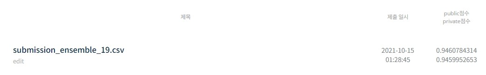

# Competition

DACON의 대회에 참여한 결과들을 남기기 위한 기록입니다.

------

## Summary

| Period  | name         | Public Ranking          | Private Ranking          | Organization            |   Docker hub          | Participation classification. |
| ------- | ------- | -------------------------------------- | ---------------------------- | -------------|---------------- |---------------- |
| 2020.08.03 ~ 09.14 | [컴퓨터 비전 학습 경진 대회](https://dacon.io/competitions/official/235626/overview/description) | [1/1,305](https://dacon.io/competitions/official/235626/leaderboard) | none | [DACON](https://dacon.io/)      | none     | Non-regular participation.    |
| 2021.09.15 ~ 10.14 | [2021 Ego-Vision 손동작 인식 AI 경진대회](https://dacon.io/competitions/official/235805/overview/description) | [13/341](https://dacon.io/competitions/official/235805/leaderboard) | [5/290](https://dacon.io/competitions/official/235805/leaderboard) | [DACON](https://dacon.io/)        | none   | Regular competition           |
| 2021.10.13 ~ 10.22 | [작물 병해 분류 AI 경진대회](https://dacon.io/competitions/official/235842/overview/description) | [49/174](https://dacon.io/competitions/official/235842/leaderboard)  | [37/174](https://dacon.io/competitions/official/235842/leaderboard) | [DACON](https://dacon.io/) | none | Regular participation.    |
| 2021.05.21 ~ 06.01 | [Data Sprint #35: Osteoarthritis Knee X-ray](https://dphi.tech/challenges/data-sprint-35-osteoarthritis-knee-x-ray/81/overview/about) | [1/27](https://dphi.tech/challenges/data-sprint-35-osteoarthritis-knee-x-ray/81/leaderboard/practice/) | none | [DPhi](https://dphi.tech/community/)| none | Non-regular participation.    |
| 2022.04.01 ~ 05.13 | [Computer Vision 이상치 탐지 알고리즘 경진대회](https://dacon.io/competitions/official/235894/overview/description) | [37/563](https://dacon.io/competitions/official/235894/leaderboard)  | [28/481](https://dacon.io/competitions/official/235894/leaderboard) | [DACON](https://dacon.io/) | none | Regular participation.    |
| 2022.05.16 ~ 05.27 | [수화 이미지 분류 경진대회](https://dacon.io/competitions/official/235896/overview/description) | [10/155](https://dacon.io/competitions/official/235896/leaderboard) |  [8/150](https://dacon.io/competitions/official/235896/leaderboard) | [DACON](https://dacon.io/) | none | Regular participation.    |
| 2022.06.13 ~ 06.24 | [음성 분류 경진대회](https://dacon.io/competitions/official/235905/overview/description) | [8/124](https://dacon.io/competitions/official/235905/leaderboard)  | [31/124](https://dacon.io/competitions/official/235905/leaderboard) | [DACON](https://dacon.io/) | none | Regular participation.    |
| 2022.08.08 ~ 09.02 | [데이콘 Basic 서울 랜드마크 이미지 분류 경진대회](https://dacon.io/competitions/official/235957/overview/description) | [3/207](https://dacon.io/competitions/official/235957/leaderboard)| [3/207](https://dacon.io/competitions/official/235957/leaderboard) | [DACON](https://dacon.io/) | none | Regular participation.    |
| 2022.11.07 ~ 12.02 | [2022 유플러스 AI Ground](https://stages.ai/competitions/208/overview/description) | [38/216](https://stages.ai/competitions/208/leaderboard) | [40/216](https://stages.ai/competitions/208/leaderboard) | [aistages](https://stages.ai/)| none  | Regular participation.    |
| 2022.12.05 ~ 01.16 | [월간 데이콘 기계 고장 진단 AI 경진대회](https://dacon.io/competitions/official/236036/overview/description) | [56/296](https://dacon.io/competitions/official/236036/leaderboard) | [61/291](https://dacon.io/competitions/official/236036/leaderboard)  | [DACON](https://dacon.io/)| [Link](https://hub.docker.com/layers/dodo9249/contest/1.0/images/sha256-7ed45b779567734bf4a40088001b4fb639923a7e7fb6884c8d10fd6601a7373d?context=repo)  | Regular participation.    |
| 2022.12.12 ~ 01.16 | [유전체 정보 품종 분류 AI 경진대회](https://dacon.io/competitions/official/236035/overview/description) | [69/724](https://dacon.io/competitions/official/236035/leaderboard) | [223/716](https://dacon.io/competitions/official/236035/leaderboard) | [DACON](https://dacon.io/) | [Link](https://hub.docker.com/layers/dodo9249/contest/1.0/images/sha256-7ed45b779567734bf4a40088001b4fb639923a7e7fb6884c8d10fd6601a7373d?context=repo) | Regular participation.    |
| 2023.01.02 ~ 01.30 | [포디블록 구조 추출 AI 경진대회](https://dacon.io/competitions/official/236046/overview/description) | [27/795](https://dacon.io/competitions/official/236046/leaderboard) | [27/795](https://dacon.io/competitions/official/236046/leaderboard) | [DACON](https://dacon.io/) | [Link](https://hub.docker.com/layers/dodo9249/contest/2.1/images/sha256-a754236716c1b27057edfa7e73830378f3a68b05452d879b25647673284891d8?context=repo) | Regular participation.    |
| 2023.02.06 ~ 03.13 | [제1회 코스포 x 데이콘 자동차 충돌 분석 AI경진대회(채용 연계형)](https://dacon.io/competitions/official/236064/overview/description) | [/]() | [/]() | [DACON](https://dacon.io/) | [Link]() | Regular participation.    |

------

## 1. 컴퓨터 비전 학습 경진 대회

{: .highlight }
> Result Description
> 
> 대회 기간 중 기록되었던 scroe 중 private, public score 1위 달성.
> 
> Private Leaderboard

{: .highlight }
> Private score

{: .highlight }
> Public score

## 2. 2021 Ego-Vision 손동작 인식 AI 경진대회

{: .highlight }
> Result Description
> 
> 5위/290명, Private 5위(0.12653), Public 12위(0.16419), [Code Share Link](https://dacon.io/competitions/official/235805/codeshare/3596)
> 
> Competition period: 2021.09.15 ~ 2021.10.14 18:00

## 3. 작물 병해 분류 AI 경진대회.

{: .highlight }
> Result Description
> 
> Public 49위/174명, 0.96121, Private 37위/174명, 0.96294
> 
> Competition period: 2021.10.13 ~ 2021.10.22 18:00

## 4. Computer Vision 이상치 탐지 알고리즘 경진대회

{: .highlight }
> Result Description
> 
> 28위/1060명, Private score 0.85507
> 
> Competition period: 2022.04.01 ~ 2022.05.13 16:59

## 5. 수화 이미지 분류 경진대회

{: .highlight }
> Result Description
> 
> Public 10위/421명 0.97196, Private 8위/421명 0.98148
> 
> Competition period: 2022.05.16 ~ 2022.05.27 23:59

## 6. 음성 분류 경진대회

{: .highlight }
> Result Description
> 
> Public 8위/113명, 0.99, Private 8위/207명
> 
> Competition period: 2022.06.13 ~ 2022.06.24 18:00

## 7. 데이콘 Basic 서울 랜드마크 이미지 분류 경진대회

{: .highlight }
> Result Description
> 
> Public 위/421명, 0.99, Private 3위/421명
> 
> Competition period: 2022.06.13 ~ 2022.06.24 18:00

## 8. 2022 유플러스 AI Ground

{: .highlight }
> Result Description
> 
> Public 38위/658팀, Private 40위/658팀
> 
> Competition period: 2022.06.13 ~ 2022.06.24 18:00

## 9. 월간 데이콘 기계 고장 진단 AI 경진대회

{: .highlight }
> Result Description
> 
> Public 56위/296명, Private 61위/627명
> 
> Competition period: 2022.06.13 ~ 2022.06.24 18:00

## 10. 유전체 정보 품종 분류 AI 경진대회

{: .highlight }
> Result Description
> 
> Public 71등/716팀, 0.99063, Private 223등/716팀, 0.96259 
> 
> Competition period: 2022.06.13 ~ 2022.06.24 18:00

## 11. 포디블록 구조 추출 AI 경진대회

{: .highlight }
> Result Description
> 
> Public 27등/461팀, 0.95799, Private 27/461팀, 0.9497
> 
> Competition period: 2022.06.13 ~ 2022.06.24 18:00

## 12. 제1회 코스포 x 데이콘 자동차 충돌 분석 AI경진대회

{: .highlight }
> Result Description
> 
> Public 8위/113명, 0.99, Private 명
> 
> Competition period: 2022.06.13 ~ 2022.06.24 18:00

