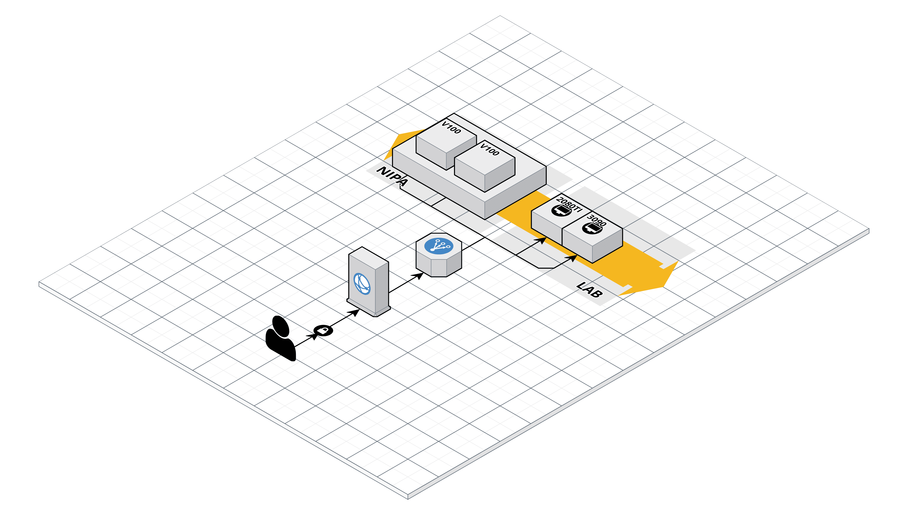

# Docker를 사용한 딥러닝 학습 환경세팅

2022년 4월 9일 현재 내가 사용하는 GPU들이다.

연구실에서 2080TI, 3090을 사용하고 있으며, NIPA를 통해 20TF 자원을 할당받아서 사용하고 있습니다.

각각 GPU마다의 Docker container를 jupyter notebook으로 연결해두어서

외부에서도 작업이 가능하게 설정해두었으며, Docker image로는 `teddylee777/dl-cuda11`를 사용하였으며, [[링크]](https://hub.docker.com/r/teddylee777/dl-cuda11)로 들어가시면 받으실 수 있습니다!

ubuntu 환경에서 docker를 사용해서 환경을 세팅하닌깐 예전에 ubuntu를 사용하면서 라이브러리 관리가 제대로 이루어지지않아서 포맷 3연벙을 당한 뒤로는 local pc에 ubuntu를 깔고싶다는 생각을 못하게 되었지만, docker를 사용하게 되면서 이러한 걱정이 싹 사라지고 오히려 안정적으로 사용하고 있다!

내가 현재 사용하는 환경은 외부망에서의 접속을 기본적으로 막아두었기 때문에 Port forwarding도 해줘야했으며, 이러한 과정에서 많은 삽질?을 했었다,,,

앞으로는 내가 docker를 사용했던 기록도 남기고, 나와 같은 error를 마주한 사람들에게 도움이 될 수 있게 docker & ubuntu & port forwarding 등등 차분차분 자세하게 글을 작성할 예정이다!

