# 모두를 위한 딥러닝 시즌2 - PyTorch Lab 1-1

## Table of contents
{: .no_toc .text-delta }

1. TOC
{:toc}

---

[1️⃣ Lab Video](https://www.youtube.com/watch?v=St7EhvnFi6c&list=PLQ28Nx3M4JrhkqBVIXg-i5_CVVoS1UzAv&index=2)

[2️⃣ Lab slide](https://drive.google.com/drive/folders/1qVcF8-tx9LexdDT-IY6qOnHc8ekDoL03)

[3️⃣ Lab code](https://github.com/deeplearningzerotoall/PyTorch/blob/master/lab-01_tensor_manipulation.ipynb)

# PyTorch Data Size

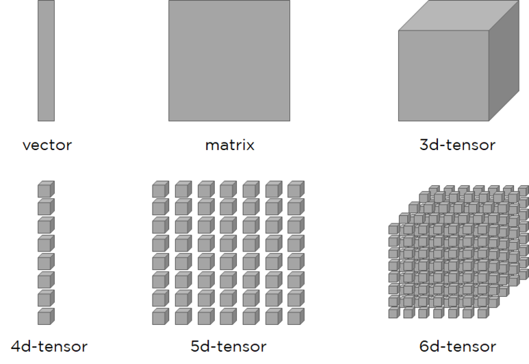

Scalar = 한 개의 데이터

Vector = 여러 개의 `Scaler`로 이루어진 배열을 의미하며, `Scalar`를 `세로`로 여러 개를 쌓은 것이다.

Matrix = 여러 개의 `Vector`로 이루어진 배열을 의미하며, `Vector`를 `가로`로 여러 개를 쌓은 것이다.

3d-tensor = 여러 개의 `Matrix`로 이루어진 배열을 의미하며, `Matrix`를 `수평`으로 여러 개를 겹친 것이다.

4d-tensor = `Scalar`를 쌓아 `Vector`를 이룬 방식과 동일하게 `3d-tensor`를 `세로`로 여러 개를 쌓은 것이다.

5d-tensor = `Vector`를 쌓아 `Matrix`를 이룬 방식과 동일하게 `4d-tensor`를 `가로`로 여러 개를 쌓은 것이다.

6d-tensor = `Matrix`를 쌓아 `3d-tensor`를 이룬 방식과 동일하게 `5d-tensor`를 `수평`으로 여러 개를 겹친 것이다.

`0을 세로`, `1을 가로`라고 생각하시면 후에 PyTorch dim(dimension)을 제어하는 데 편합니다.

# PyTorch Tensor Shape Convention

## 2D Tensor (Typical Simple Setting)

- |t| = (batch size, dim)

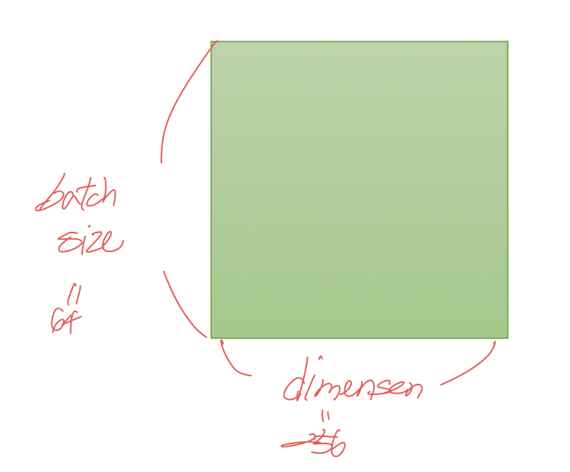

훈련 데이터 하나의 크기를 `256`이라고 해봅시다. 

`[3, 1, 2, 5, ...]` 이런 숫자들의 나열이 `256의 길이`로 있다고 상상하면됩니다. 

다시 말해 `훈련 데이터 하나 = 벡터의 차원`은 `256`입니다. 

만약 이런 훈련 데이터의 개수가 `3000개`라고 한다면, 현재 전체 훈련 데이터의 크기는 `3,000 × 256`입니다. 행렬이니까 2D 텐서네요. 

3,000개를 1개씩 꺼내서 처리하는 것도 가능하지만 컴퓨터는 훈련 데이터를 하나씩 처리하는 것보다 보통 덩어리로 처리합니다. 

3,000개에서 64개씩 꺼내서 처리한다고 한다면 이 때 `batch size를 64`라고 합니다.

그렇다면 컴퓨터가 한 번에 처리하는 `2D 텐서의 크기는 (batch size × dim)=64×256`입니다.

## 3D Tensor (Typical Computer Vision)

- |t| = (batch size, width, height)

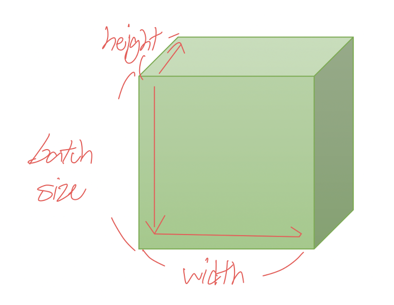

실제로 비전 분야의 이미지를 처리하게 되면 훨씬 더 큰 사이즈의 `Tensor`를 다루게 됩니다.

위의 사진은 이미지를 Tensor화 하여 시각화 한 것이며, 위의 설명한 `batch size`만큼의 `이미지가 쌓여 하나의 3D Tensor`를 이룬것입니다.

## 3D Tensor (Typical Natural Language Processing)

- |t| = (batch size, length, dim)

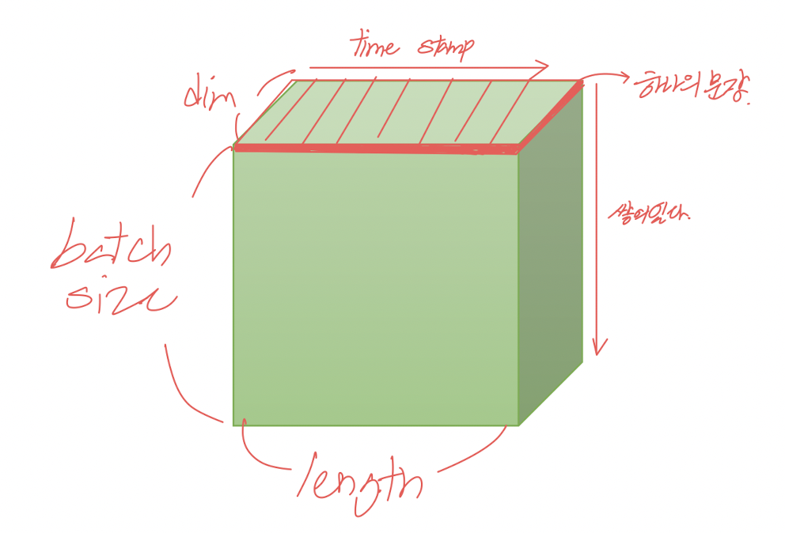

추가적으로 자연어 처리 분야의 데이터를 Tensor화 한 것을 시각화 한 것입니다.

앞서 설명한 이미지가 쌓여있는 것처럼, 그림에서의 `빨간색 부분이 하나의 문장을 의미`합니다.

문장은 `Length`와 `Time stamp`를 기준으로 나누어져 있으며,

비전에서 설명한 것과 동일하게 `문장이 batch size만큼 쌓여있다`는 의미입니다.

# 실습

## Numpy

### 1D Array with Numpy

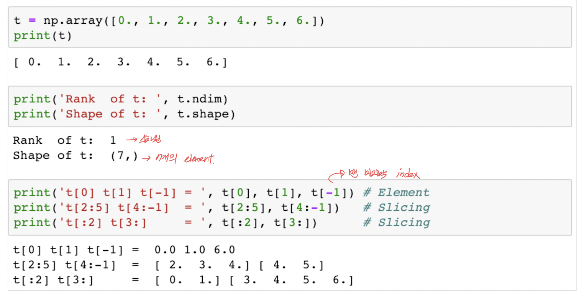

Numpy와 PyTorch의 동작 방식을 거의 유사하며, PyTorch가 더 유용한 라이브러리가 존재하기에 많이 사용됩니다.

`ndim`은 몇 차원인지를 출력합니다. 1차원은 벡터, 2차원은 행렬, 3차원은 3차원 텐서였습니다. 

현재는 벡터이므로 1차원이 출력됩니다. 

`shape`는 크기를 출력합니다. `(7, )`는 `(1, 7)`을 의미합니다. 

다시 말해 `(1 × 7)`의 크기를 가지는 벡터입니다.

Numpy를 통해 배열의 인덱스로 접근이 가능하며, 슬라이싱으로 변환도 가능합니다.

슬라이싱은 `[시작 번호 : 끝 번호]`로 범위 지정을 통해 가져오며, `:2`, `3:`의 경우 시작 번호, 끝 번호가 생략된 것이며, `0:2`, `3:-1`을 의미하는 것 입니다.

### 2D Array with Numpy

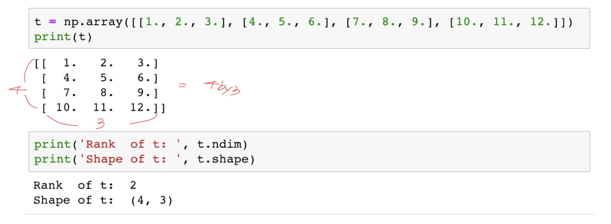

위에서 설명한대로, `ndim`은 차원을 출력하며, `shape`는 크기를 출력합니다.

## PyTorch Tensor

### 1D Array with Numpy

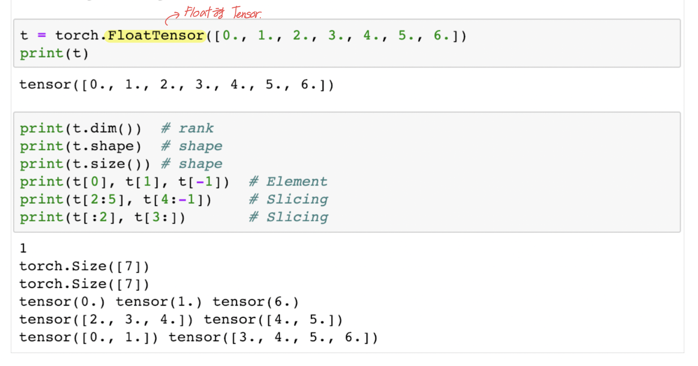

Numpy를 활용법과 동일하게 PyTorch에서도 동일하게 작동합니다.

### 2D Array with Numpy

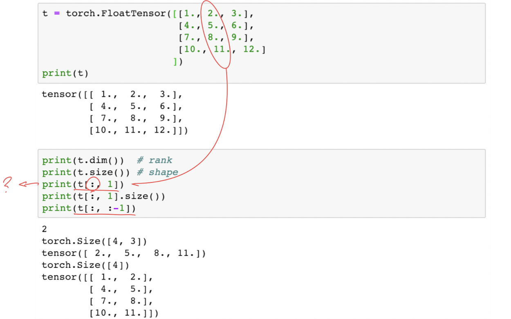

`t[:, 1]`의 결과는 첫번째 차원(`[1,2,3]`)을 전체 선택하고, 그 상황에서 두번째 차원의 1번 인덱스 값(`2`)만을 가져온 경우를 보여줍니다. 

다시 말해 텐서에서 두번째 열에 있는 모든 값을 가져온 상황입니다. 

그리고 이렇게 값을 가져온 `t[:, 1].size()`경우의 크기는 4입니다. (1차원 벡터)

`t[:, :-1]`의 결과는 첫번째 차원을 전체 선택한 상황에서 두번째 차원에서는 맨 마지막에서 첫번째를 제외하고 다 가져온다.

### Broadcasting

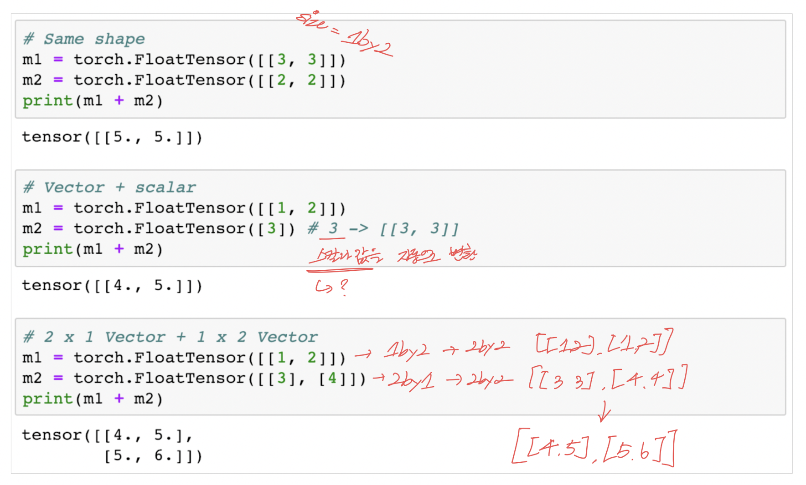

두 행렬 A, B가 있다고 해봅시다. `행렬의 덧셈과 뺄셈`에 대해 알고계신다면, 

이 덧셈과 뺄셈을 할 때에는 두 행렬 A, B의 크기가 같아야한다는 것을 알고계실겁니다. 

그리고 두 행렬이 곱셈을 할 때에는 A의 마지막 차원과 B의 첫번째 차원이 `일치`해야합니다.

이러한 배열의 크기를 맞춰주기 위한 `PyTorch`에서는 자동으로 맞춰주기 위한 기능을 제공합니다.

2번째 단락에서 행렬의 사이즈를 맞춰주기 위해서 `Scalar`로만 이루어진 `[3]`을 `[3, 3]`으로 변환하여서 연산을 수행합니다.

3번째 단락에서는 `1by2`, `2by1` 두 개의 사이즈가 다른 행렬의 연산을 위해서 `2by2`로 변환 후 연산을 수행하여 `2by2` 행렬의 결과가 나온걸 확인할 수 있습니다.

### Multiplication vs Matrix Multiplication

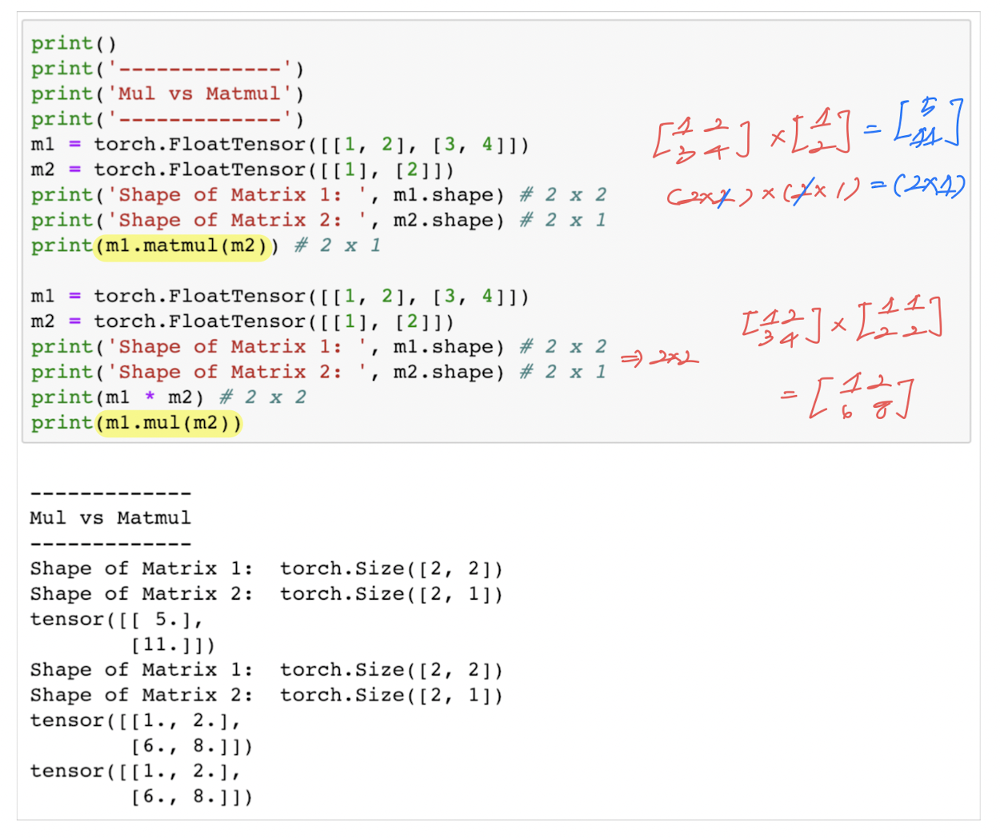

행렬로 곱셈을 하는 방법은 크게 두 가지가 있습니다. 

바로 `행렬 곱셈(matmul)`과 `원소 별 곱셈(mul)`입니다.

`행렬 곱셈(matmul)`은 입출력 행렬 사이즈가 동일해야하기 때문에, 사이즈 변환을 거치지않고 연산을 수행하며,

`원소 별 곱셈(mul)`은 2by1로 이루어진 행렬 `([1], [2])`를 `([1,1], [2,2])`로 변환하여 연산을 수행하게 됩니다.

### Mean

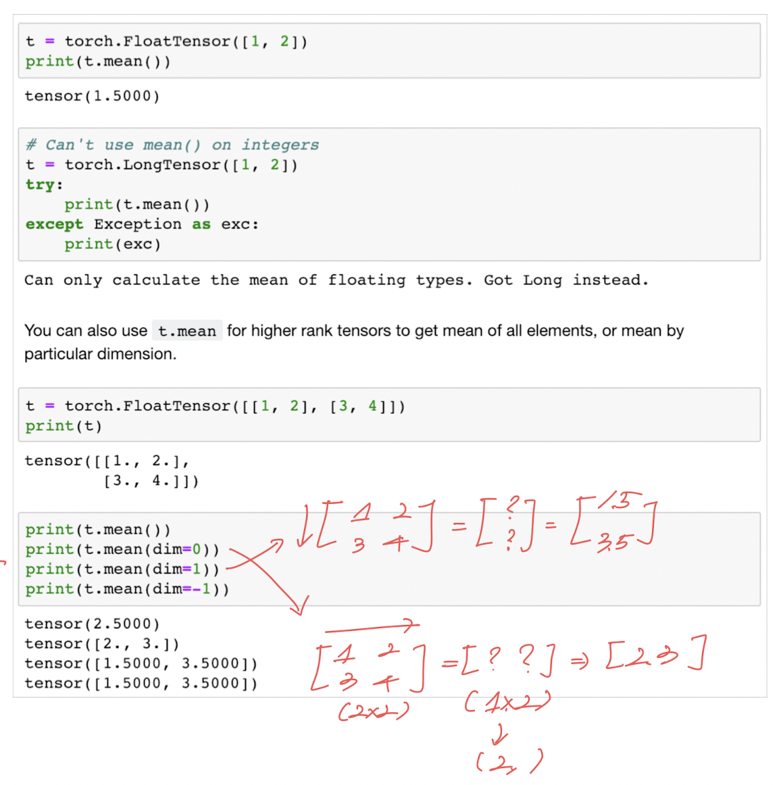

행렬의 평균을 계산하기 위한 기능도 존재합니다.

1~2번째 단락에서는 `1,2`의 평균이 1.5가 계산되어 출력되지만, LongTensor로는 작동하지 않습니다.

3~4번째 단락에서는 2차원 행렬을 선언하여 평균을 구하였으며, 

`mean()`은 전체 원소에 평균을 계산하여 출력되며, `mean()`의 `dim`은 차원을 의미합니다. 

`dim = 0`은 첫번째 차원을 의미합니다. 

행렬에서 첫번째 차원은 `행`을 의미합니다. 

그리고 인자로 `dim`을 준다면 해당 차원을 제거한다는 의미가 됩니다. 

다시 말해 행렬에서 `열`만을 남기겠다는 의미가 됩니다. 

기존 행렬의 크기는 `(2, 2)`였지만 이를 수행하면 열의 차원만 보존되면서 `(1, 2)`가 됩니다. 

이는 `(2,)`와 같으며 벡터입니다. 

열의 차원을 보존하면서 평균을 구하면 `([2., 3.])`와 같이 연산합니다.

### Sum

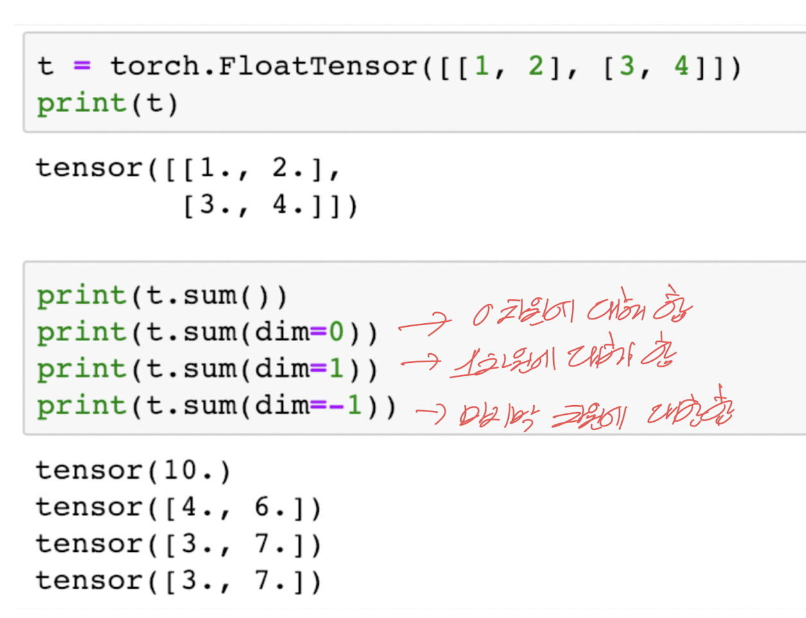

`sum()`은 `Mean`과 연산 방법이나 인자가 의미하는 바는 정확히 동일합니다. 다만, 평균이 아니라 덧셈을 할 뿐입니다.

`sum(dim=0) = 행을 제거`, `sum(dim=1) = 열을 제거`, `sum(dim=-1) = 열을 제거`를 의미합니다.

### Max and Argmax

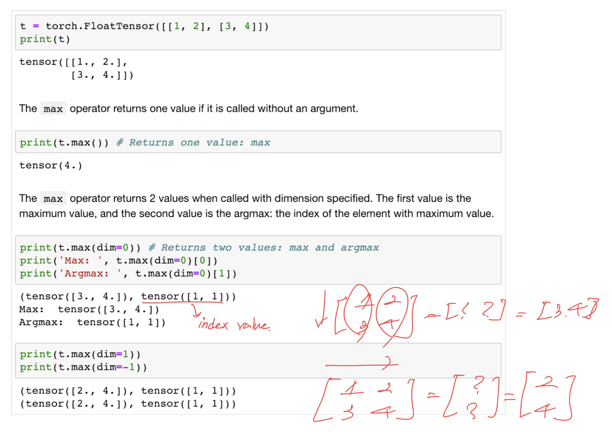

`Max`는 원소의 최대값을 리턴하고, `ArgMax`는 최대 값을 가진 인덱스를 리턴합니다.

두번째 단락의 `dim = 0`을 선언한 경우 첫번째 차원을 제거한다는 의미입니다.

그런데 `[1, 1]`이라는 값도 함께 리턴되었습니다. 

`max`에 `dim 인자`를 주면 `argmax`도 함께 리턴하는 특징 때문입니다. 

첫번째 열에서 3의 인덱스는 1이었습니다. 두번째 열에서 4의 인덱스는 1이었습니다. 그러므로 [1, 1]이 리턴됩니다.

만약 두 개를 함께 리턴받는 것이 아니라 `max` 또는 `argmax`만 리턴받고 싶다면 다음과 같이 리턴값에도 인덱스를 부여하면 됩니다. `0번 인덱스`를 사용하면 `max` 값만 받아올 수 있고, 

`1번 인덱스`를 사용하면 `argmax` 값만 받아올 수 있습니다.

# 참조

PyTorch로 시작하는 딥러닝 입문 - https://wikidocs.net/52460

모두를 위한 딥러닝 시즌2 PyTorch - https://github.com/deeplearningzerotoall/PyTorch

