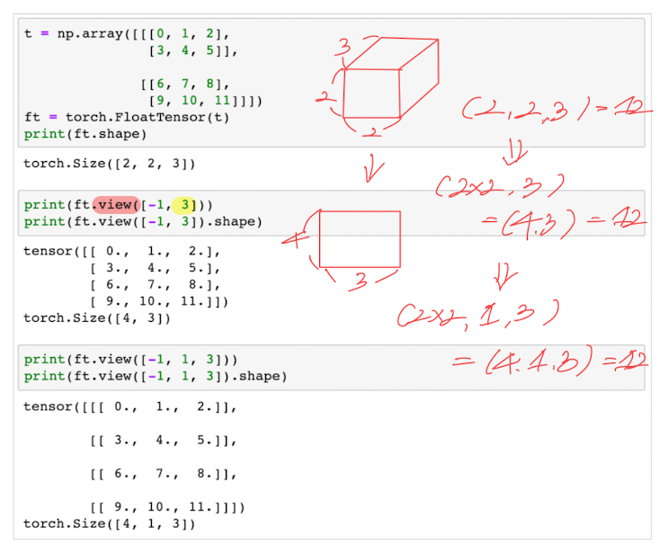
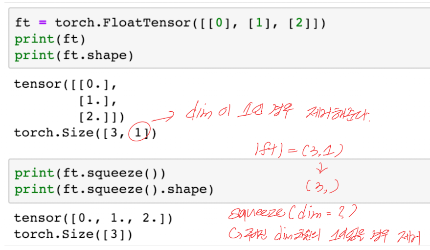
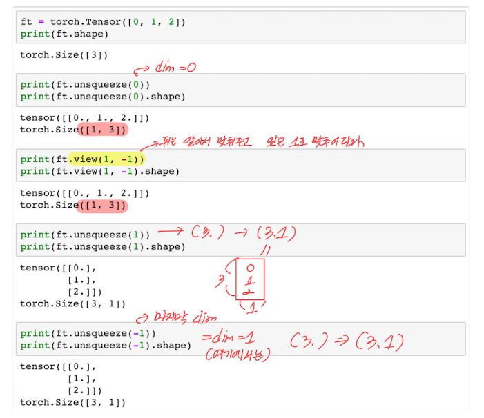
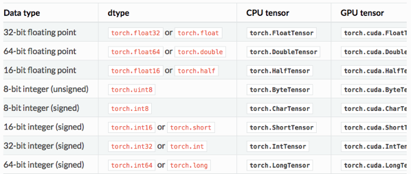
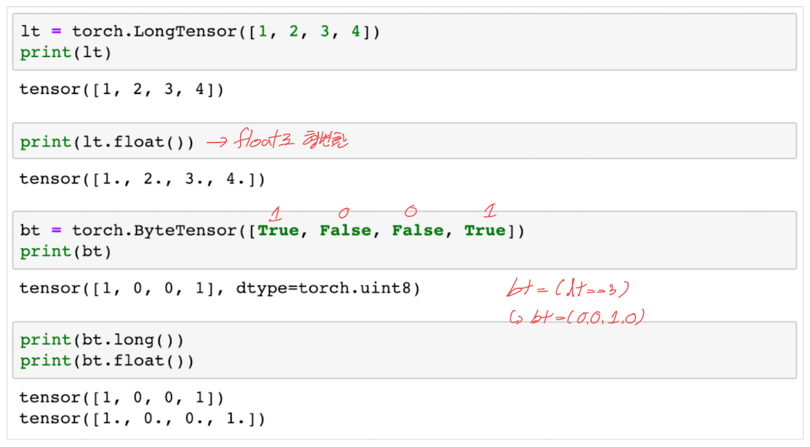
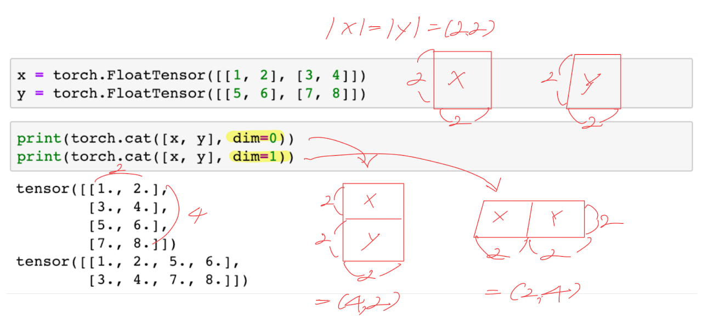
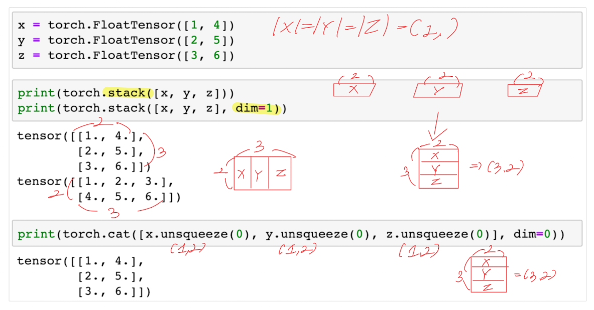
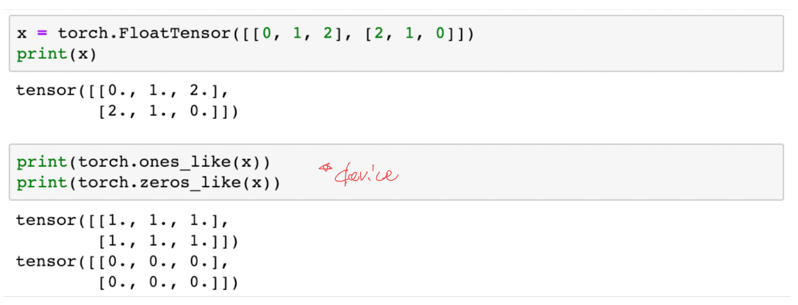
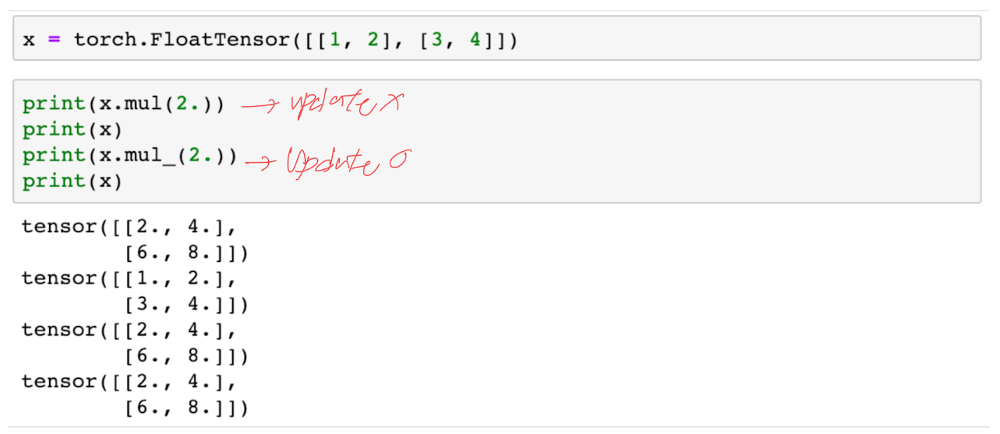

# 모두를 위한 딥러닝 시즌2 - PyTorch Lab 1-2

## Table of contents
{: .no_toc .text-delta }

1. TOC
{:toc}

---

[1️⃣ Lab Video](https://www.youtube.com/watch?v=XkqdNaNQGx8&list=PLQ28Nx3M4JrhkqBVIXg-i5_CVVoS1UzAv&index=3)

[2️⃣ Lab slide](https://drive.google.com/drive/folders/1qVcF8-tx9LexdDT-IY6qOnHc8ekDoL03)

[3️⃣ Lab code](https://github.com/deeplearningzerotoall/PyTorch/blob/master/lab-01_tensor_manipulation.ipynb)

# Other Basic Ops

## View (Reshape)



`View`는 `Numpy`에서의 `Reshape`와 같은 역할을 하며, 전체 텐서의 크기를 변경해주는 역할을 합니다.

두번째 단락에서 첫 번째 단락의 `[2,2,3]`의 3차원 텐서를 `view[-1,3]`을 통해 변경한 결과 `[4,3]`가 나온 것을 확인할 수 있습니다.

여기서 `view[-1,3]`가 의미하는 바는 `[?, 3]`의 크기로 텐서를 바꾸어달라는 의미이며, `?`에 해당하는 부분은 PyTorch에 역할을 맡겨 자동으로 크기를 변경해줍니다.

또한 세번째 단락처럼 텐서의 차원을 유지하며, 크기를 바꿀수도있습니다.

`[2,2,3]`을 `[?,1,3]` 사이즈로 크기를 변경해달라고 하는 의미입니다.

그래서 최종적으로 `[4,1,3]`이 되는 것을 알 수 있습니다.

여기서 `?`가 `4`로 되는 이유가 궁금하실겁니다.

그 이유는`View`는 `기존적으로 변경 전과 변경 후의 텐서 안의 원소의 개수가 유지되어야한다`는 규칙이 있기 때문입니다. 그 결과 `2x2x3 = 12`, `4x3 = 12`, `4x1x3 = 12` 모두 원소의 
개수는 변함이 없는 것을 알 수 있습니다.

## Squeeze



`Squeeze`는 단어 자체가 의미하는 바 그대로 `짜다`라는 의미를 나타냅니다.

차원을 줄이는 기능을 하며, 차원이 1인 경우에만 동작합니다. 

예시로 2차원 벡터 `[3,1]`가 `[3,]` 1차원 벡터가 된 것을 알 수 있습니다.

## Unsqueeze



`Squeeze`와는 정확하게 반대의 기능이며, 해당 함수는 특정 위치에 1인 차원을 추가합니다.

특정 위치의 차원을 사용자가 지정하며, `unsqueeze(0)`은 첫 번째 차원에 1인 차원을 추가하여 `[3]`이 `[1,3]`으로 변경된 결과를 확인할 수 있습니다.

물론 해당 결과는 `view[1,-1]`로도 동일한 결과를 얻을 수 있습니다.

`unsqueeze(1)`는 두 번째 차원에 1인 차원을 추가하겠다는 의미이기에 `[3]`이 `[1,3]`으로 변경된 것을 알 수 있으며, 이를 통해 `unqueeze`에 사용되는 `0,1`은 차원의 index 번호임을 눈치채셨을 겁니다!

인덱스 번호를 매개변수로 받아 동작한 다는 것을 알게되었으니, 당연히 `-1`도 동작함을 마지막 단락에서 확인할 수 있으며, 마지막 차원에 1을 추가하게 됩니다.

```
추가 : view(), squeeze(), unsqueeze()는 텐서의 원소 수를 그대로 유지하면서 모양과 차원을 조절합니다.
```

## Type Casting



Tensor에는 위와 같이 자료형이 데이터형별로 정의되어 있습니다.



`float()`를 붙이면 기존의 long 타입의 텐서가 형변환을 하는 것을 확인할 수 있습니다.

이러한 형변환을 PyTorch에서는 제공하고 있으며, 학습에 필요한 데이터 형을 곧바로 사용할 수 있다는 이점이 있습니다.

## Concatenate



딥러닝을 학습시키기 위해서 여러 개의 Tensor를 합치는 것은 비일비재한 일이며, 이번에는 두개의 텐서를 합치는 방법을 알아보겠습니다!

먼저 여기서 `0(세로),1(가로)`은 차원을 의미하며 차원의 방향을 의미합니다.

(왜 방향이 저렇게 정해지는 지에 대해서는 [링크](https://velog.io/@d9249/모두를-위한-딥러닝-시즌2-PyTorch-Lab-1-1)에 설명되어 있으니 읽어보심이 좋습니다.)

연결하고자 하는 텐서를 주어준 후 차원의 방향을 매개변수로 지정하여 원하는 합쳐진 Tensor를 얻을 수 있었습니다!

## Stacking



연결을 하는 또 다른 방법인 **Stacking**입니다. 때로는 연결을 하는 것보다 스택킹이 더 편리할 때가 있는데, 이는 스택킹이 많은 연산을 포함하고 있기 때문입니다.

두번째 단락에서 차원을 지정해준 것과 아닌 것의 결과가 비교되어 있습니다.

여기서도 마찬가지로 `dim`을 통해서 쌓이는 방향을 매개변수로 받아 동작함을 알 수 있습니다.

추가적으로 마지막 단락에서는 `Stack()` 함수의 축약된 연산을 보여주고 있으며, 동일한 결과를 얻을 수 있습니다.

## Ones and Zeros



`ones_like()`는 모두 1로 이루어진 행렬로 바꾸며,

`zeros_like()`는 모두 0으로 이루어진 행결로 바꾸는 기능을 합니다.

## In-place Operation



`mul()`, `mul_()` 모두 동일한 연산이지만 가장 큰 차이점은 기존의 값의 **Update** 유무입니다. `mul_()`은 기존의 값을 Update하여 값을 수정하지만, `mul()`은 Update를 하지않고 계산 후 사라지는 것을 확인하였습니다.

# 참조

PyTorch로 시작하는 딥러닝 입문 - https://wikidocs.net/52460

모두를 위한 딥러닝 시즌2 PyTorch - https://github.com/deeplearningzerotoall/PyTorch