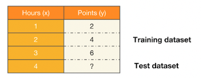
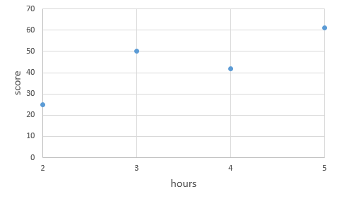
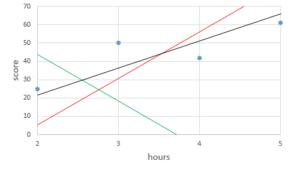
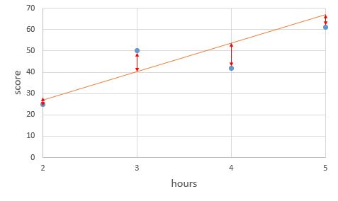

# 모두를 위한 딥러닝 시즌2 - PyTorch Lab 2

## Table of contents
{: .no_toc .text-delta }

1. TOC
{:toc}

---

[1️⃣ Lab Video](https://www.youtube.com/watch?v=sVUbNEM9Ap0&list=PLQ28Nx3M4JrhkqBVIXg-i5_CVVoS1UzAv&index=5)

[2️⃣ Lab slide](https://drive.google.com/drive/folders/1qVcF8-tx9LexdDT-IY6qOnHc8ekDoL03)

[3️⃣ Lab code](https://github.com/deeplearningzerotoall/PyTorch/blob/master/lab-03_minimizing_cost.ipynb)

# 데이터에 대한 이해(Data Definition)



예를 들어, 1시간을 공부하면 2점을 맞고 2시간을 공부하면 4점을 맞춘다는 위의 표와 같은 가정을 한다면, `우리는 4시간 공부하면 몇 점을 맞지?`가 궁금합니다.

이에 대한 답변을 우리는 쉽게 생각할 수 있지만, 우리는 `모델을 사용하여서 몇 점을 맞을 지 예측`하고 싶은 것이며, 이를 위해 모델에 데이터를 학습시키는 과정을 거치며, 

이때 사용되는 데이터 셋을 `훈련 데이터셋`이라고 하며, 추가적으로 이 모델이 얼마나 잘 작동하는지 테스트 할 필요성이 있기에 이때 사용되는 데이터셋이 `테스트 데이터 셋`이라고 합니다.

### 훈련 데이터 셋

```
x_train = torch.FloatTensor([[1], [2], [3]])
y_train = torch.FloatTensor([[2], [4], [6]])
```

여기서 x_train은 공부한 시간, y_train은 공부한 시간에 따라 얻는 점수를 의미합니다.

# 가설(Hypothesis) 수립

우리는 주어진 주어진 학습 데이터와 가장 잘 맞는 하나의 직선을 찾는 일을 `선형 회귀`라고 하며,

$y = Wx+b$ 라는 형식의 선형 회귀의 가설(직선의 방정식)과 같은 형식을 갖습니다.

여기서 $y$는 가설에서 따와 $H(x)$로 나타내기도 합니다.

여기서 $x$에 곱해지는 $W$를 `가중치(Weight)`라고 하며, $b$를 `편향(bias)`라고 합니다.

# 손실 계산하기 (Compute loss)

**비용 함수(cost function) = 손실 함수(loss function) 

= 오차 함수(error function) = 목적 함수(objective function)**

라고 보통 지칭하며, `loss function`에 대해 예제를 통한 설명을 이어나가겠습니다.



우리는 4개의 훈련 데이터가 있고, 이를 2차원 그래프에 4개의 점으로 나타내었고,
우리가 학습을 하는 목표는 이러한 4개의 점을 가장 잘 표현하는 직선을 찾는 일 입니다.



예시로 위와 같은 3개의 직선을 그렸습니다.

여기서 어떤 직선이 4개의 점을 가장 잘 표현한다고 할 수 있을까요???

저는 3개 중에 고르자면, 검은색이라고 말하겠지만, 이러한 선택은 주관적인 생각으로 이루어진 생각이기에 4개의 점을 가장 잘 나타내는 선이라는 근거는 부족할 수 밖에 없습니다.

이러한 근거를 마련하기 위해서 `오류(error)`라는 개념을 도입하였습니다.



위의 주황색 직선의 식은 $y = 13x+1$이며, 4개의 점과 주황색 직선의 예측 값에 대한 차이를 빨갠색 화살표로 표현이 되어있습니다.

이는 각 실제 값과 각 예측 값과의 차이이고, 이를 각 실제 값에서의 오차라고 말할 수 있습니다.

`개별 오차`는 구하였지만, `총 오차`는 어떻게 구할까요?

직관적으로 모든 오차를 더 하게 되면 총 오차를 구할수 있을 것 같아 먼저 모든 수를 더하겠습니다.
  
| hours($x$) | 2 | 3 | 4 | 5 |
|:----------:|:----------:|:----------:|:----------:|:----------:|
| 실제값 | 25 | 50 | 42 | 61 |
| 예측값 | 27 | 40 | 53 | 66 |
| 오차 | -2 | 10 | -9 | -5 |

위와 같은 표에 개별 오차가 적혀있으며, 이를 단순히 덧셈을 하게 된다면, 거리에 대한 절대 값이 아니라서 제대로 된 오차의 크기라고 하기에는 어려움이 있습니다.

이를 개선하기 위해서 각 오차의 제곱을 모두 더한 값을 사용하도록 하겠습니다.

이를 수식으로 표현하면, 아래와 같으며 $n$은 갖고 있는 데이터의 개수를 의미하며,

$y^{(i)}$는 실제 값을 의미하고, $H(x^{(i)})$는 예측 값을 의미합니다.

$$
\displaystyle\sum_{i=1}^{n}[y^{(i)}-H(x^{(i)})]^2 = (-2)^2+10^2+(-9)^2+(-5)^2 = 210
$$

이때 데이터의 개수인 $n$으로 나누면, 오차에 제곱합에 대한 평균을 구할 수 있으며, 
이를 `평균 제곱 오차(Mean Squared Error, MSE)`라고 합니다.
이러한 과정은 아래의 수식으로 나타낼 수 있습니다.

$$
\frac{1}{n}\displaystyle\sum_{i=1}^{n}[y^{(i)}-H(x^{(i)})]^2 = 210/4 = 52.5
$$

위에 계산된 `평균 제곱 오차` 52.5 값은 $y=13x+1$의 예측 값과 실제 값의 평균 제곱 오차의 값을 의미합니다.
이러한 `평균 제곱 오차` 값을 최소 값으로 만드는 $W$와 $b$를 찾아내는 것이 우리의 목표이며,
$W$와 $b$를 찾기 위해서 최적화된 식이 `평균 제곱 오차`입니다.

$$
cost(W,b) = \frac{1}{n}\displaystyle\sum_{i=1}^{n}[y^{(i)}-H(x^{(i)})]^2
$$

최종적으로 정리하면 위와 같이 나타낼 수 있으며, $Cost(W,b)$가 최소가 되게 만드는 $W$와 $b$를 구하면 훈련 데이터를 가장 잘 나타내는 직선입니다.

이러한 이론을 PyTorch로 아래와 같이 나타낼 수 있습니다.

```
W = torch.zeros(1, requires_grad=True)
b = torch.zeros(1, requires_grad=True)
hypothesis = x_train * W + b

cost = torch.mean((hypothesis - y_train) ** 2)
```

$W$와 $b$는 초기에 0으로 초기화하여서 사용하여야하며, `requires_grad=True`는 학습에 사용하겠다고 설정하는 것이며, `torch.mean`으로 `평균 제곱 오차`를 손쉽게 구할 수 있습니다.


# 경사 하강법 (Gradient Descent)

`비용 함수(cost function)`의 값을 최소로 하는 $W$와 $b$를 찾는 방법을 코드로만 간단히 알아보겠습니다.

```
W = torch.zeros(1, requires_grad=True)
b = torch.zeros(1, requires_grad=True)
hypothesis = x_train * W + b

cost = torch.mean((hypothesis - y_train) ** 2)

optimizer = optim.SGD([W,b], lr=0.01)

nb_epochs = 1000
for epoch in range(1, nb_epochs+1):
    optimizer.zero_grad()
	cost.backward()
	optimizer.step()
```

전체 학습 과정의 Code이며, `zero_grad()`로 gradient를 0으로 초기화하고, `backward()`로 비용 함수를 미분하여 gradient를 계산한 다음, `step()`로 $W$와 $b$를 업데이트합니다.

여기서 `zero_grad()`가 필요한 이유는 파이토치가 미분을 통해 얻은 기울기를 이전에 계산된 기울기 값에 누적시키는 특징이 있기 때문이며, Code를 통해 예를 들어 설명하겠습니다. 

```
import torch
w = torch.tensor(2.0, requires_grad=True)

nb_epochs = 20
for epoch in range(nb_epochs + 1):

  z = 2*w

  z.backward()
  print('수식을 w로 미분한 값 : {}'.format(w.grad))
```

위의 코드를 실행하면, 

```
수식을 w로 미분한 값 : 2.0
수식을 w로 미분한 값 : 4.0
수식을 w로 미분한 값 : 6.0
수식을 w로 미분한 값 : 8.0
수식을 w로 미분한 값 : 10.0
수식을 w로 미분한 값 : 12.0
수식을 w로 미분한 값 : 14.0
수식을 w로 미분한 값 : 16.0
수식을 w로 미분한 값 : 18.0
수식을 w로 미분한 값 : 20.0
수식을 w로 미분한 값 : 22.0
수식을 w로 미분한 값 : 24.0
수식을 w로 미분한 값 : 26.0
수식을 w로 미분한 값 : 28.0
수식을 w로 미분한 값 : 30.0
수식을 w로 미분한 값 : 32.0
수식을 w로 미분한 값 : 34.0
수식을 w로 미분한 값 : 36.0
수식을 w로 미분한 값 : 38.0
수식을 w로 미분한 값 : 40.0
수식을 w로 미분한 값 : 42.0
```

다음과 같은 결과 값을 얻을 수 있으며, 계속해서 미분 값인 2가 누적되는 것을 볼 수 있습니다.

그렇기 때문에 `zero_grad()`를 통해 미분값을 계속 0으로 초기화시켜줘야 합니다.

여기서 사용된 `옵티마이저(Optimizer)`를 통해 최적화된 $W$와 $b$를 찾는 것을 `학습`이라고 부르며, 다음 페이지에서는 `옵티마이저(Optimizer) 알고리즘`에 대해 알아보겠습니다.

# 참조

PyTorch로 시작하는 딥러닝 입문 - https://wikidocs.net/52460

모두를 위한 딥러닝 시즌2 PyTorch - https://github.com/deeplearningzerotoall/PyTorch