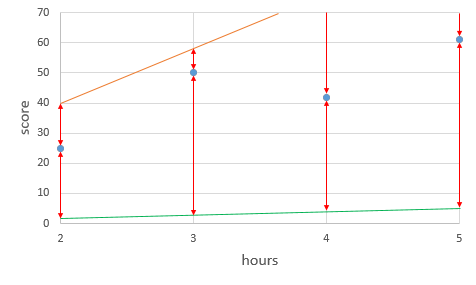
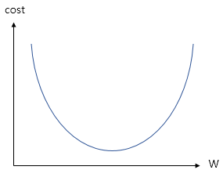
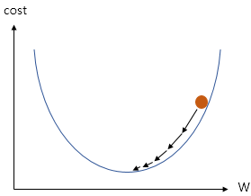
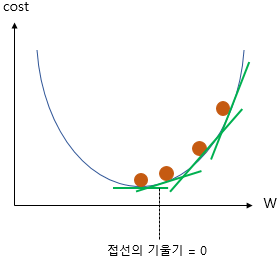
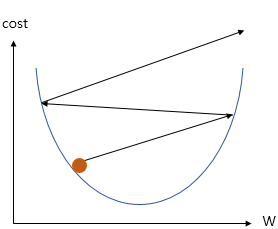

# 모두를 위한 딥러닝 시즌2 - PyTorch Lab 3

## Table of contents
{: .no_toc .text-delta }

1. TOC
{:toc}

---

[1️⃣ Lab Video](https://www.youtube.com/watch?v=kyjBMuNM1DI&list=PLQ28Nx3M4JrhkqBVIXg-i5_CVVoS1UzAv&index=4)
[2️⃣ Lab slide](https://drive.google.com/drive/folders/1qVcF8-tx9LexdDT-IY6qOnHc8ekDoL03)
[3️⃣ Lab code](https://github.com/deeplearningzerotoall/PyTorch/blob/master/lab-02_linear_regression.ipynb)

# 경사 하강법 (Gradient Descent)

이제 앞서서 설명한 `비용 함수(cost function)`의 값을 최소로 하는 $W$와 $b$를 찾는 방법을 알아보겠습니다. 

이때 사용하는 것을 `옵티마이저(Optimizer) 알고리즘`이라고 하며, 이러한 `옵티마이저`를 통해 최적화된 $W$와 $b$를 찾는 것을 `학습`이라고 부릅니다.

저는 경사하강법의 설명을 쉽게하기 위해 $b$는 고려하지 않고, $W$를 구하는 방식에 대해 설명하겠습니다.



가중치 $W$는 직선의 방정식의 기울기이며, 위의 그림에서 주황색 선은 기울기 $W$가 20일 때, 초록색 선은 기울기 $W$가 1일 때를 나타냅니다.

주황색 선은 $y=20x$, $y=x$에 해당되는 직선이며, 빨간색 거리의 차이는 각 점에서의 실제 값과 두 직선의 예측 값과의 오차를 시각화하였습니다.

이를 통해 기울기가 지나치게 크면 실제 값과 예측 값의 오차가 커지고, 기울기가 지나치게 작아도 실제 값과 예측 값의 오차가 커진다는 것을 알 수 있게 되었습니다. 

이는 $b$도 마찬가지 입니다.



위의 그래프는 $b$는 고려하지 않은 단순히 가중치 $W$만을 사용한 $H(x)=Wx$라는 가설의 시각화입니다.

기울기 $W$가 무한대로 커지면 커질수록 `cost`의 값 또한 무한대로 커지고, 반대로 무한대로 작아져도 `cost`의 값은 무한대로 커집니다. 

그래프에서 `cost`가 가장 작을 때는 맨 아래의 볼록한 부분이며, 이 부분에 해당하는 `cost(W)`가 가장 최소값을 가지게하는 `W`를 찾는 것이 목표입니다.



위의 그래프는 $cost(W)$를 최소화하는 $W$를 찾기위한 과정의 그림이며, $W$값이 점차 수정되는 과정에 사용하는 것이 바로 `경사 하강법(Gradient Descent)`입니다.



이러한 과정을 위해서 `미분`을 사용하게 되며, 위의 그림의 초록색 선은 $W$가 임의의 값을 가지게 되는 4가지 경우에 대해서 그래프 상으로 `접선의 기울기`를 보여줍니다.

`접선의 기울기`가 낮은 방향으로 갈수록 `접선의 기울기`가 점차 작아지며, 0에 가까워지는 것을 볼 수 있습니다.

이를 통해 `cost(W)`가 최소화가 되는 지점은 `접선의 기울기`가 `0`이 되는 지점이며, 

또한 `미분 값이 0이 되는 지점`입니다.

$$
접선의 기울기 = \frac {\delta cost(W)}{\delta W}
$$

접선의 기울기가 0이 되는 지점을 찾기 위해 반복되는 과정에 특정 숫자 $\alpha$를 곱한 값을 빼서 새로운 $W$로 사용하는 식이 사용되며, 기울기가 음수일 때와 양수일때 $W$값의 변화를 알아보겠습니다.

## 기울기가 음수일 때 : 기울기의 값이 증가
$$
W := W - \alpha * (음수기울기) = W+\alpha * (양수기울기)
$$

기울기가 음수면 위의 식을 통해 결과적으로 $W$의 값이 증가하게 되고, 

이는 결과적으로 접선의 기울기가 0인 방향으로 $W$의 값이 조정됩니다.

## 기울기가 양수일 때 : 기울기의 값이 감소

$$
W := W - \alpha *(양수기울기)
$$

기울기가 양수면 $W$의 값이 감소하게 되며, 이는 음수일때와 마찬가지로 접선의 기울기가 0인 방향으로 $W$의 값이 조정됩니다.

아래의 수식은 접선의 기울기가 음수거나, 양수일 때 모두 접선의 기울기가 0인 방향으로 $W$의 값을 조정합니다.

$$
W := W - \alpha \frac{\delta}{\delta W}cost(W)
$$

여기서 사용된 $\alpha$는 학습률을 의미하며, 학습률은 $W$의 값을 변경할 때, 얼마나 크게 변경할지를 결정하는 값입니다. 

이는 $W$를 그래프의 한 점으로보고 접선의 기울기가 0일 때까지 경사를 따라 내려간다는 관점에서 얼마나 큰 폭으로 이동할지를 결정하는 변수입니다.



하지만, 학습률이 지나치게 높은 값을 가질 때, 접선의 기울기가 0이 되는 $W$를 찾아가는 것이 아니라, 오히려 반대로 $W$의 값이 발산하는 상황을 보여줍니다.

또 지나치게 너무 낮은 값을 가지면 학습속도가 느려지기 때문에 적당한 값의 학습률을 찾아내는 것도 중요합니다.

설명을 위해 $b$는 제외하였지만, 실제 학습에서는 $W$, $b$의 최적을 동시에 수행하게 됩니다.

# 경사하강법의 PyTorch Code

```
optimizer = optim.SGD([W, b], lr=0.01)
```

`경사 하강법`의 PyTorch를 사용한 구현입니다. 

아래의 `SGD`는 경사 하강법의 일종입니다. `lr`은 `학습률(learning rate)`를 의미합니다.

학습 대상인 `W`와 `b`가 SGD의 입력이 됩니다.

```
# gradient를 0으로 초기화
optimizer.zero_grad() 
# 비용 함수를 미분하여 gradient 계산
cost.backward() 
# W와 b를 업데이트
optimizer.step() 
```

`optimizer.zero_grad()`를 실행하므로서 미분을 통해 얻은 기울기를 0으로 초기화합니다. 

기울기를 초기화해야만 새로운 가중치 편향에 대해서 새로운 기울기를 구할 수 있습니다. 

그 다음 `cost.backward()`함수를 호출하면 `가중치 W`와 `편향 b`에 대한 기울기가 계산됩니다. 

그 다음 경사 하강법 최적화 함수 opimizer의 `step()`함수를 호출하여 인수로 들어갔던 W와 b에서 리턴되는 변수들의 기울기에 `학습률(learining rate) = 0.01`을 곱하여 빼줌으로서 업데이트합니다.

# 참조

PyTorch로 시작하는 딥러닝 입문 - https://wikidocs.net/52460

모두를 위한 딥러닝 시즌2 PyTorch - https://github.com/deeplearningzerotoall/PyTorch