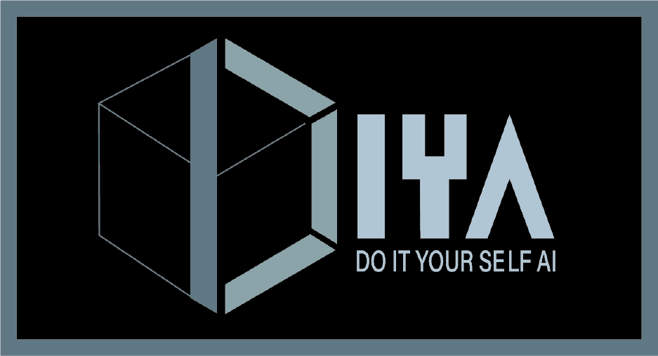

# 2021년 동안 한 활동

## Table of contents
{: .no_toc .text-delta }

1. TOC
{:toc}

---

## Paper review

1. ImageNet Classification with Deep Convolution Neural Network

2. Network In Network

3. Visualizing and Understanding Convolutional Networks

4. OverFeat: Integrated Recognition, Localization and Detection using Convolutional Networks

5. Spatial Pyramid Pooling in Deep Convolutional Networks for Visual Recognition

6. Very Deep Convolutional Networks for Large-Scale Image Recognition

7. Going Deeper with Convolutions

위와 같은 논문들을 이론적으로 리뷰하였으며, 코드로 함께 구현하지 않아 아쉬웠다고 생각하며,

2022년도에는 논문 리뷰를 진행하는 경우, 이론적인 이해와 구현을 함께 진행하려고 노력해야겠다.

## Competitions

**1. DACON 컴퓨터비전학습경진대회**

DIYA 4기 Computer Vision Team에서 활동하며, 팀장님이 이론적인 리뷰에서 더 나아가 구현 능력을 기르기 위해서 Computer Vision 관련 대회에 참가하게 되었으며, 정규 대회는 아니였고 연습삼아 나가본 대회였다. 

해당 대회에서 다양한 실험을 실행하면서 딥러닝의 학습의 기초를 어느정도 다질 수 있었으며, 정규 대회는 아니지만 그래도 대회의 Public, 대회 당시의 Private Score 보다 높은 성능을 기록하여서 내가 생각했던 부분들에 대한 정확도가 나쁘지않았구나 하고 생각이 들어 약간의 뿌듯함?을 느낄 수 있었습니다.

또한 해당 대회의 실험 기록을 가지고 `2021 한국인터넷정보학회 추계학술발표대회`에 참가하였으며, `겹친 문자 이미지 분류를 위한 합성곱 신경망 모델의 정확도 분석`을 발표하였습니다.

**2. 2021 Ego-Vision 손동작 인식 AI 경진대회**

DIYA 4기 Computer Vision Team에서 참가하는 2번째 대회였으며, 해당 대회는 정규 대회 기간에 참가하여서 많은 참가자들과 경쟁을 하였고, 해당 대회에서 최종 5위를 기록하였습니다.

팀장님이 생각하신 Crop을 데이터 전처리로 사용하였고, 해당 방법은 똑같이 적용하며 사용하지 않았던 모델들을 적용함으로써 기존 성능보다 높은 성능을 보일 수 있었으며, 팀원들중에서는 가장 높은 성능을 보였지만, 1등팀과의 점수격차가 너무나도 크게 벌어졌기 때문에 약간의 좌절감?과 뿌듯함을 동시에 느끼는 대회였습니다.

다음 대회에 참가하게 된다면, 1등팀처럼 여러 사람들과 브레인스토밍도 진행하고 여러 방법론들을 적용하면서 혼자 참가하는 대회가 아니라 팀으로써 참가하고싶다고 느꼈습니다.

**3. 작물 병해 분류 AI 경진대회**

**4. 2021 교통 수(手)신호 동작 인식 AI 경진대회**

위의 두개의 대회에 참가는 하였지만, 해당 기간에 대학원 수업, 논문 발표 등등 여러가지 일들이 겹쳐 대회에 제대로 참가하지 못하였으며, 시간이 좀 더 있었더라면, 좀 더 노력했더라면 하면서 반성을 하였습니다.

## 아쉬운 점

2021년 약 1년동안 처음으로 대외활동이라는 것을 경험하면서 많은 것을 배웠고, 나보다 뛰어난 사람들이 정말 많다라는 것도 느끼게 되었으며, Deep Learning에 많은 흥미를 느낄수 있었던 1년이였지만, 2학기에는 DIYA 4기 Computer Vision Team이 중도이탈자도 생기고 팀장님도 바뀌면서 1학기 보다 더 여러가지의 활동을 진행하지 못하여서 아쉬운 마음을 가지고 2021년 DIYA 4기 Computer Vision Team으로써의 활동을 마무리하고 2022년도에는 DIYA 5기 ML and GNN Team에 속하게 되었기에 2022년도에는 아쉬움이 남지 않도록 열심히 참가할 것을 목표로 하고 있습니다.

[[DIYA Blog Link]](https://blog.diyaml.com)