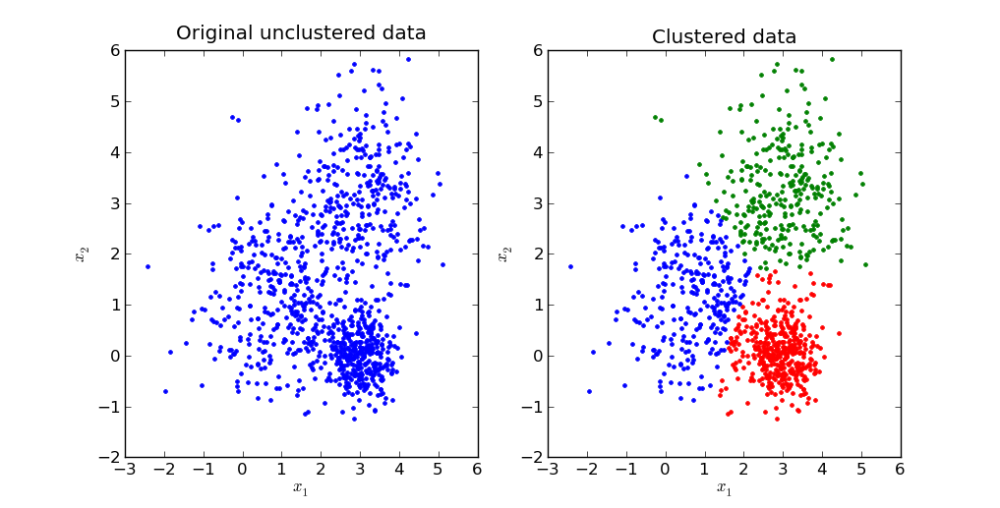
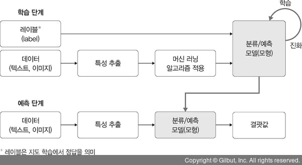
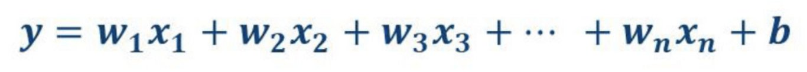
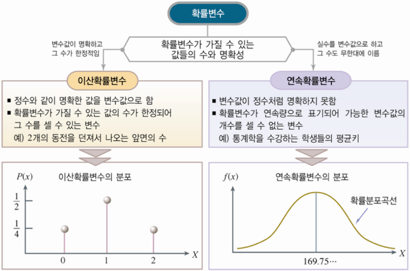

# TITLE: 모두를 위한 딥러닝 시즌1 - Lecture 1

## Table of contents
{: .no_toc .text-delta }

1. TOC
{:toc}

---

[1️⃣ Lecture Video](https://www.youtube.com/watch?v=qPMeuL2LIqY)
[2️⃣ Lab Video](https://www.youtube.com/watch?v=-57Ne86Ia8w)
[3️⃣ Lecture slide](https://hunkim.github.io/ml/lec1.pdf)
[4️⃣ Lecture slide](https://docs.google.com/presentation/d/137IlT2N3AYcclqxNuc8j9RDrIeHiYkSZ5JPg_vg9Jqk/edit?usp=sharing)

# What is ML?
> ML(Machine Learning)은 문제해결을 위한 하나의 방법이다.
왜냐하면, 실제 프로그래밍으로 문제를 해결하려면, 많은 변수와 상황에 대한 대응이 가능해야하는데, 이를 프로그래머가 모든 상황에 대비해서 프로그램을 설계하기가 많이 힘들기 때문에 이러한 문제를 해결하기 위해서 컴퓨터가 학습을 통해 모든 상황에 대한 대응한다는 개념을 1959년 "Arthur Samuel"이라는 분이 처음으로 정립하였다.

# What is learning?

## Supervised/Unsupervised Learning
> 한국어로는 지도/비지도학습이라고 하며, 지도학습은 라벨링된 학습데이터를 모델에게 학습시키는 방법론을 말하며, 지도학습의 예로는 개, 고양이, 머그컵, 고양이의 해당하는 사진을 충분한 양을 모델에게 주어 학습을 진행한 후 4개의 분류에 해당하는 새로운 이미지가 들어올경우 새로운 사진이 무엇인지 맞추는 일련의 과정을 이야기합니다.
ex) 사진 분류, 이메일 스팸 필터, 시험 점수 예측(공부에 시간을 쓴 만큼 성적이 나온다라는 가정)

> 비지도학습은 라벨링이 되어있지않은 데이터를 모델에게 학습시키는 방법을 말합니다. 비지도 학습의 예로는 구글 뉴스의 종류는 그룹화하거나, 단어를 군집화(클러스터링)하는 것들을 말합니다.

### 군집화(Clustering)

이미지출처 : https://www.google.com/url?sa=i&url=http%3A%2F%2Fsanghyukchun.github.io%2F69&psig=AOvVaw3u6cH-TWoYaXxq_w2utYv8&ust=1649413794515000&source=images&cd=vfe&ved=0CAoQjRxqFwoTCLCL463fgfcCFQAAAAAdAAAAABAN

위의 그림의 왼쪽 데이터를 모델에게 주어주고 학습을 통해 오른쪽처럼 동일하거나 유사한 데이터를 의미하는 것들끼리 묶는 과정을 의미합니다.

### Training 과정

이미지 출처 : https://www.google.com/url?sa=i&url=https%3A%2F%2Fthebook.io%2F080263%2Fch01%2F02%2F01%2F&psig=AOvVaw0jUKFkBJ0kAF-f316ArPyh&ust=1649419513452000&source=images&cd=vfe&ved=0CAoQjRxqFwoTCOiWoNn0gfcCFQAAAAAdAAAAABAD

위의 그림에서 볼 수 있듯이 라벨과 데이터를 모델에 입력으로 사용하여, 새로운 데이터(텍스트, 이미지)가 들어오면 학습결과를 통해 예측된 결괏값을 리턴받게 됩니다.

### Supervised learning의 종류

1. regression
2. binary classification
3. multi-label classification

# What is regression?

regression(회귀)란, 통계학에서 여러 개의 독립변수와 한 개의 종속변수 간의 상관관계를 모델링하는 기법을 통칭한다.
예를 들어 아파트 방 개수, 크기, 주변 학군 등 여러 개의 독립변수에 따라 아파트 가격이라는 종속변수가 어떤 관계를 나타내는지를 모델링하고 예측하는 방법이다.
즉, 머신러닝 관점에서 본다면 독립변수는 feature에 해당하고, 종속변수는 결정값에 해당한다. 
여기서 핵심은 주어친 feature와 결정 값 데이터에서 학습을 통해 최적의 회귀 계수를 찾아내는 것이다.

선형 회귀식 / w = 회귀 계수, x = 독립 변수, y = 종속 변수

출처 : https://john-analyst.medium.com/회귀-regression-란-398c548e1560

# What is classification?

전체적으로 위의 경우처럼 크게 2,3번에 해당하며, 이 중 이진분류는 개냐 고양이냐 둘 중 하나의 경우를 맞추는 경우이며, 다중 분류의 경우는 A, B, C, D, E중 해당하는 부분을 찾아내는 것처럼 여러 개의 라벨을 가진 데이터속에서 분류하는 것을 의미한다.

## regression vs multi-label classification

하지만, multi-label classification은 단순하게 생각해서 엄청나게 많은 라벨을 가진 경우에 해당하지 않느냐라고 생각할 수 있지만, 결정적인 차이점은 multi-label classification은 아래의 그림처럼 이산확률변수와 같은 데이터를 예측하는 것이며, regression은 연속확률변수를 의미하기에 이 두 개의 경우는 확실하게 다르다할 수 있다.

이미지 출처 : https://www.google.com/url?sa=i&url=https%3A%2F%2Fdbrang.tistory.com%2F1086%3Fcategory%3D944552&psig=AOvVaw3YdrgCVeIbUCF9epaC2lRp&ust=1649419815801000&source=images&cd=vfe&ved=0CAoQjRxqFwoTCPD7iOX1gfcCFQAAAAAdAAAAABAD