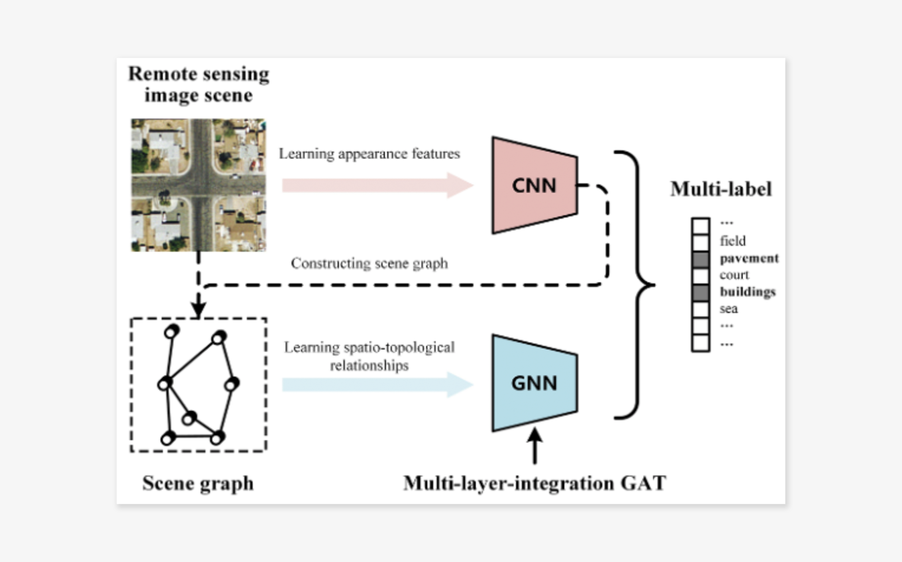
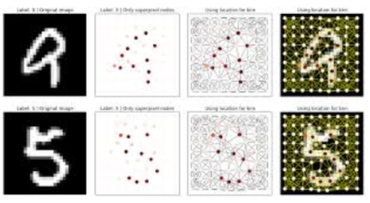

# 글로벌 1위 기업 시니어 머신러닝 사이언티스트가 말하는 “GNN”

## Table of contents
{: .no_toc .text-delta }

1. TOC
{:toc}

---

Link: https://tenbiz.co.kr/25286/

# Summary

```
요즘, 전 세계 머신러닝 사이언티스트들 사이에서 핫하게 떠오르고 있는 알고리즘이 있습니다. 바로 딥러닝 뉴럴네트워크 GNN(Graph Neural Network)입니다. GNN은 코로나로 인한 팬데믹의 영향으로 최근 2년간 급격히 성장한 주제입니다. 지식 그래프, 연관 검색어, 소셜 미디어의 연결, 코로나 확장 그래프 등 한마디로 ‘요즘 뜨는 검색 방식’은 모두 GNN이 더 잘 해결할 수 있다고 해요. 

글로벌 FAANG 기업 중 한 회사에서 시니어 머신러닝 사이언티스트로 일하고 있는 ‘하비에르 알론조 로페즈 박사’는 GNN 전문가로서, 매일같이 GNN을 다루며 살아가고 있습니다. 그가 머신러닝 사이언티스트가 된 이유는 무엇인지, 또 그가 생각하는 GNN은 어떤 것인지 들어보았습니다.
```



## Q1. 

그렇다면 GNN이 실제 산업 현장에서 어떻게 활용되는지도 궁금한데요. 주로 어떤 업무에 가장 밀접하게 연관되어있나요? 

## A1. 

GNN 분야는 NLP, SNS, 추천 시스템, 컴퓨터 비전 등 다양한 분야에 접목되어 있습니다. 

대표적으로 Facebook의 ‘친구 관리’, ‘넷플릭스’의 추천 알고리즘 등 많은 글로벌 기업에서 활용되고 있는 강력한 기술이죠. 저는 Geo AI 전문가로서, GNN을 활용하여 지도를 생성하는 업무를 진행하고 있습니다. 

참고로 말하자면, 여러분이 보시는 온라인 지도의 15% 이상은 딥러닝으로 생성되는 것입니다. 이것을 가능케 하는 것 중 하나가 바로 ‘GNN’ 이죠. 이렇게 매일같이 GNN을 사용하며 경험과 저만의 노하우를 쌓았습니다. 

GNN은 결코 혼자서 공부하기 쉬운 분야가 아닙니다. 하지만, 머신러닝 그리고 딥러닝과 함께하는 사람이라면 GNN을 반드시 공부해야 합니다. 

저의 수업에서는 Message Passing부터 시작하여 GNN에 대한 기초적 이해를 바탕으로 Graph Embedding을 깊이 있게 다룹니다. 

이어서 GCN, GRN 등을 살펴본 뒤 NLP, 추천 시스템 등 다양한 GNN 응용 분야까지 알아갈 수 있습니다. 저와 같이 차근차근 계단을 밟아가며 실력을 향상시키고 싶은 사람에게 이 강의를 추천해 드립니다.    

---



## Q2. 

마지막으로, 박사님께 GNN은 어떤 의미인지 알고 싶어요. 매일같이 GNN과 함께하는 입장에서 의미가 특별할 것 같습니다. 

## A2. 

저에게 GNN은 지난 몇 년 동안 집중해 온 ‘새로운’ 관심 분야입니다. GNN은 CNN의 자연스러운 진화라고 생각합니다. 

데이터 간 연결을 표현하는 유연성과 표현 가능성을 감안할 때 컴퓨터 비전에서 소셜 네트워크 또는 NLP, 트래픽 관련 문제에 이르기까지 여러 분야에 걸쳐 적용할 수 있을 것으로 생각합니다. 

머신러닝의 일부 응용 분야에 혁명을 일으키리라 생각하기 때문에 GNN이 특별하다고 말할 수 있습니다.