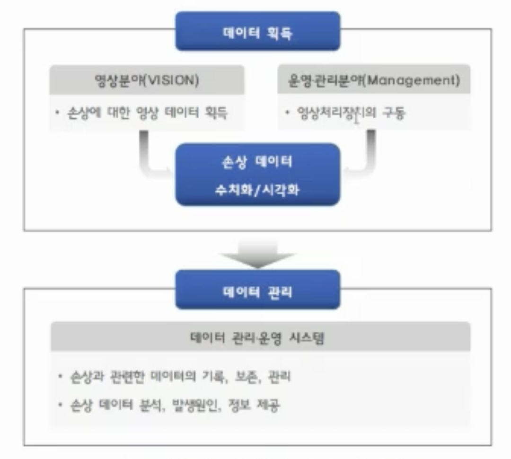
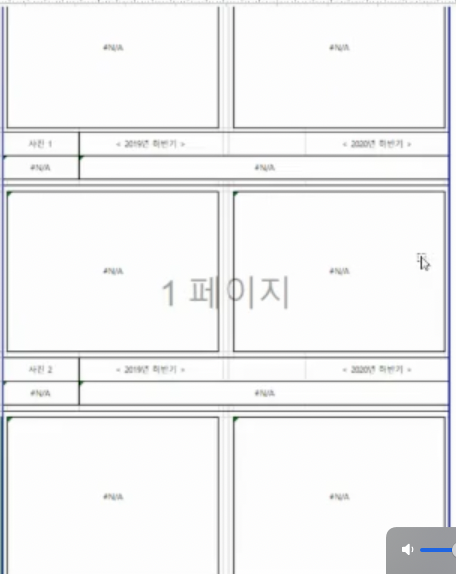
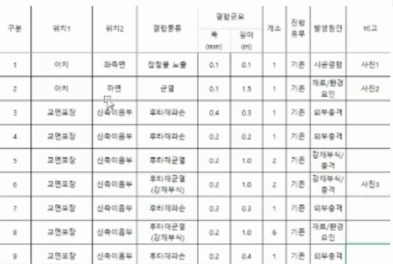
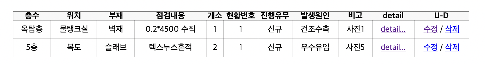
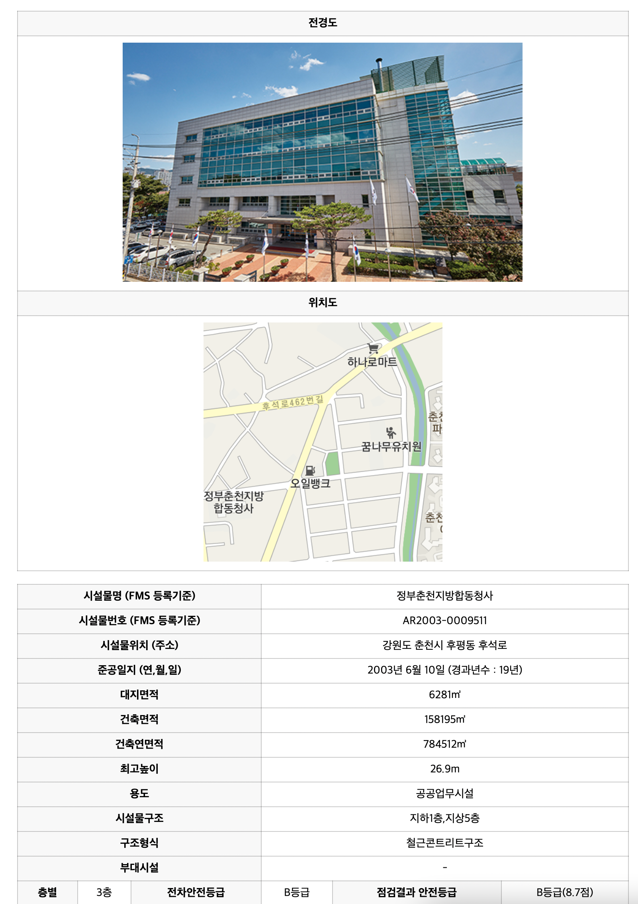
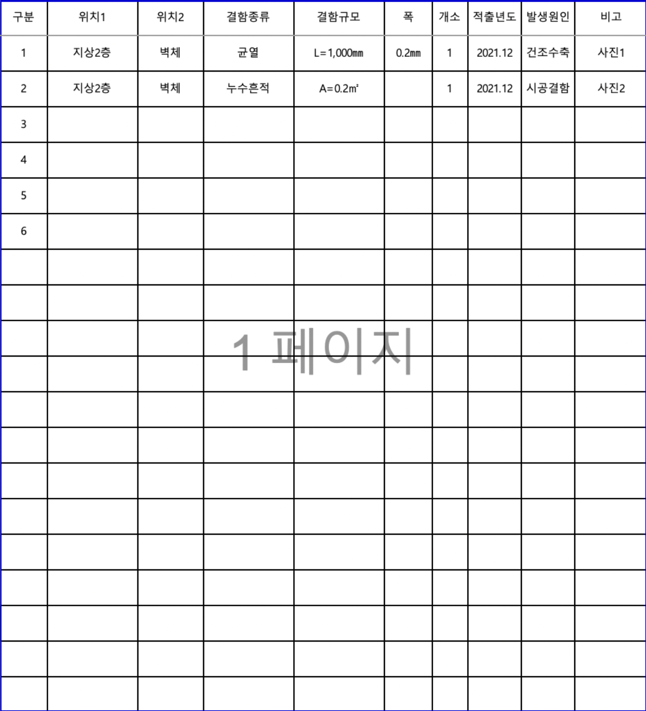
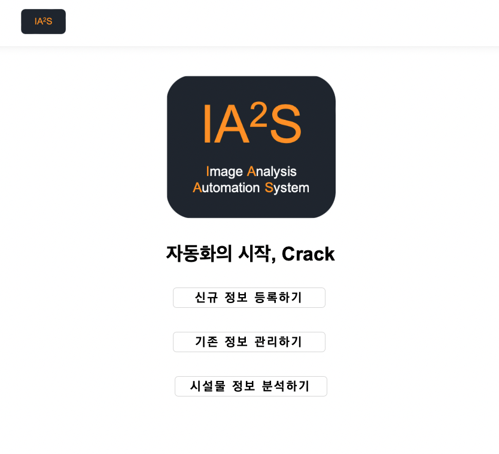

# IA^2S(Image Analysis Automation System)

## Table of contents
{: .no_toc .text-delta }

1. TOC
{:toc}

# 1. 개발 이유

| 😀 Member | 담당파트 | Github |
|:----------:|:----------:|:----------:|
| 한상준 | FS, PM, Design | [Link]() |
| 임한민 | FE | [Link]() |
| 이상민 | Senior, CEO | [Link](https://github.com/d9249) |

해당 프로젝트는 경기대학교 도시교통공학과 전경식 박사님 연구에 기반이 되는 프로그램 제작을 경기대학교 김남기 교수님을 통해 제작 의뢰를 받았으며,
총 3명의 경기대학교 컴퓨터공학부 동기들과 21년 11월~2월간 제작하였다.

# 2. 개발 의도

본 프로젝트의 기본 토대는 건물의 균열 분석에 대한 자동화 시스템을 만드는 것이다.

기존의 건물의 유지보수 관리를 업무로 하는 기업들은 현재까지도 인력을 기반으로 하여, 건물의 유지보수 관리를 위한 균열 사진찍기, 위치기록, 건물 정보 등을 수기로 관리하며 이를 또 
정리하기 위해 문서작업, 기록 등 모든 업무들이 수작업을 통해 이루어지고 있다.

업무 능률의 향상을 위해 기존의 업무를 대체할 자동화 시스템 구축을 목표로 하였다.

# 3. 개발 목표

먼저, 가장 중요한 균열의 길이 측정에 오차를 줄이는 것이 가장 큰 목표이다.

해당 시스템의 코어라고 볼 수 있는 길이 측정에 오차가 상당하다면 해당 프로젝트는 기존의 업무를 대체할 수 없을 것이라고 생각하기 때문이다.

그리고 이러한 길이 측정의 높은 정확도를 기반으로한 다음 단계로는  

# 4. 개발

## 4.0 사용자 시나리오

1. 입력을 받는다.

2. 사진 3개를 넣는다. (위치도, 전경도, 균열 이미지)

3. 크랙이미지에 대한 점검표 작성
	- 균열이 존재하는 층에 대한 정보
    - x층 크랙에 대한 대한 점검표
    - y층 크랙에 대한 대한 점검표

4. 전체에 정보에 대한 엑셀 파일로의 출력

## 4.1 요구사항명세 #1

1. 검색이 가능해야 하며 검색명은 시설물명으로만 한다.

2. 일반현황 데이터

---

| 시설물명(FMS등록기준) | 정부춘천지방합동청사 | 시설물번호(FMS등록기준) | AR2003-0009511 |
| --- | --- | --- | --- |
| 시설물위치(주소) | 강원도 춘천시 후평동 후석로 440번길 64 | 준공일지(연,월,일) | 2003년 12월 26일(경과년수 : 17년) |
| 대지면적 | 6,281m^ | 건축면적 | 1,581,95 m^2 |
| 건축연면적 | 7,845,12m^2 | 최고높이 | 26.9m |
| 용도 | 공공업무시설 | 시설물구조 | 지하1층, 지상5층 |
| 구조형식 | 철근콘트리트구조 | 부대시설 |  |

---

| 층별 | 3층 | 전차안전등급 | B등급 | 점검결과 안전등급 | B등급(8.7점) |
| --- | --- | --- | --- | --- | --- |

---

1. input img : crack, 위치도, 전경 및 부위별사진 3장이 들어간다.
2. 데이터베이스 저장된 손상 물량 정보 (날짜가 필요할 것 같다)

---

| 층수 | 위치 | 부재 | 점검내용 폭(mm)X길이(m), 유형 결함내용(면적,mxm) | 개소 | 현황번호 | 진행유무 | 발생원인 | 비고 |
| --- | --- | --- | --- | --- | --- | --- | --- | --- |
| 옥탑층 | 물탱크실 | 벽재 | 0.2* 4,500 수직 | 1  | 1 | 신규 | 건조수축 | 사진1 |
|  | 기계실  | 벽재 | 0.2x3500 수직, 수평 | 1 | 3 |  |  |  |
| 5층 | 복도 | 슬래브 | 텍스누스흔적 | 2 | 1 | 신규 | 우수유입 | 사진5 |
| 1층 |  |  |  |  |  |  |  |  |
| 2층 |  |  |  |  |  |  |  |  |

---

5. categoty page 초안

6. 목표하는 Excel 결과물

## 4.2 추가 개선사항명세 #2

1. 엑셀에 들어가는 이미지 : 원본사진은 조금 더 크게 평탄화 사진은 비율에 맞춰서 원본보다는 작게
2. 넓이를 구하는 기능 추가 : 평탄화 된 이미지는 `길이`  또는 `면적` 중 하나만 구한다. 구한 값을 엑셀에 넣을때 길이는 L = Xm 면적은 A = Xm^2
3. `categoryDetail`  그림 1만 보이고 그림 2는 다른페이지에 나타내기

4. 엑셀의 손상현황표는 그림 3처럼

5. `추가됐으면 하는것` : 엑셀의 글씨체 변경(나중에 알려줄 예정), 엑셀 데이터에 따른 자동 너비조정, 웹페이지에서 글씨체 조정(나중에 알려줄 예정)

6. 오토크랙 자동화의 시작 크랙(로고 메인페이지 변경) → 나중에 알려줄예정

7. 메뉴 Data → 가명으로 신규버튼

8. 건물 정보 등록하기 → 신규(새로운데이터등록), 기존(원래데이터 보기) ,분석(detail 안에 페이지 바로가기)

9. builidingdetail 전경도 위치도 세부정보 순이 아니라 → 세부정보 전경도 위치도

10. 입력할때도 세부정보 전경도 위치도 순으로

11. 건물정보 → 시설물정보(시설물명,연면적,전경,위치도 사진 보는곳으로 연결, 수정도 필요), 층별정보 →  손상정보() 버튼을 추가해서 균열 사진을 바로 등록할 수 있는 버튼 보고서생성 수정버튼은 시설물정보 안에서 기존에 있던 엑셀 다운로드 버튼은 보고서 생성으로 이름변경

12. 엑셀 글씨체 `윤고딕` 엑셀에 들어가는 이미지 한글 기준 77x57 이미지 비율에 맞춰서
이미지  → 이미지는 항상 가로가 긴 이미지가 들어온다.

13. 원본이미지 평탄화 된 이미지 두 개는 비율에 맞게 사진

14. 표에 테두리

## 4.3 개발 stack
> Python, Django, HTML, CSS, Javascript, OpenCV

## 4.4 구현 기능

- 균열 이미지 평탄화
- 균열 길이 측정
- openpyxl을 이용한 데이터 자동화
- 카테고리 검색
- excel 결과 보고서 자동 생성

## 4.3 결과물

다음과 같이 전체 프로젝트가 제작되었다.

# 5. 프로젝트를 진행하며 배운 점

외주를 맡아 프로젝트를 진행하는 것은 처음이였다.
해당 프로젝트는 인원수가 적어서 팀장이라고 할 것은 없지만, 중간에서 전체적인 개발 관리를 하였는데, 이론적으로만 알던 개발자의 시점과 비전공자의 시점이 너무 극명하게 들어나서, 해당 프로젝트는 약 3번의 전체 프로젝트를 뒤집고 다시 제작하는 불상사와 2번의 프로젝트 로직 변경을 필요로 하는 경우가 발생하였다.

첫번째로 그 원인은 요구사항 명세를 확실하게 하지않아서라고 생각하며,
두번째로는 요구사항이 급변하는 경우에 기존의 개발되던 프로젝트들이 무용지물이 되는 경험을 하였다,,

결론은 비전공자와 전공자의 시점은 너무나도 극명하게 다르니 요구사항 명세를 정말 확실하게 해야한다고 느꼈다. 

그렇지 않을경우 해당 프로젝트처럼 교수님들마다 방향성이 달라 프로젝트가 아예 달라지는 경우 너무나 허탈하였다.

# 6. 주소

[[Github]](https://github.com/HHFEHH/crack-automation)
