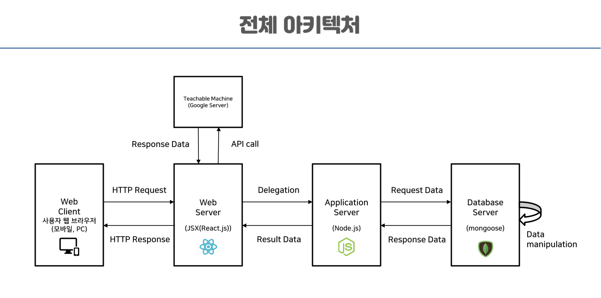
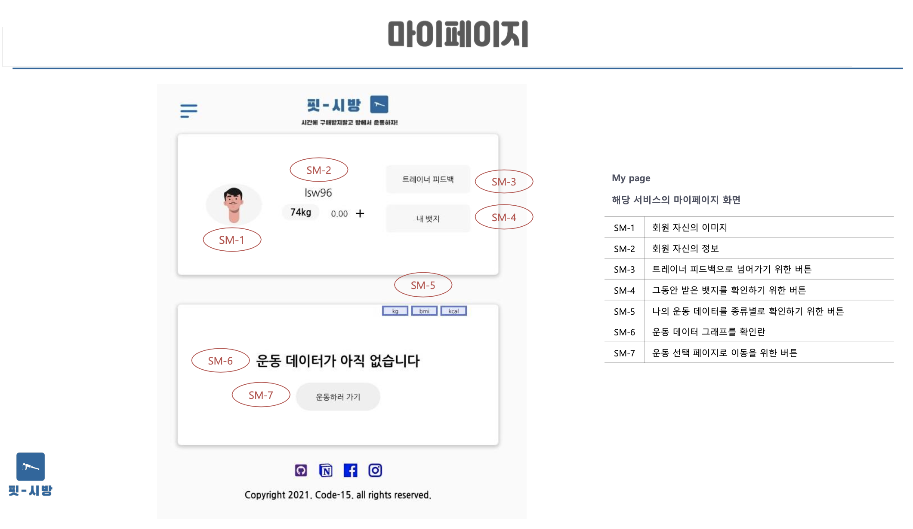
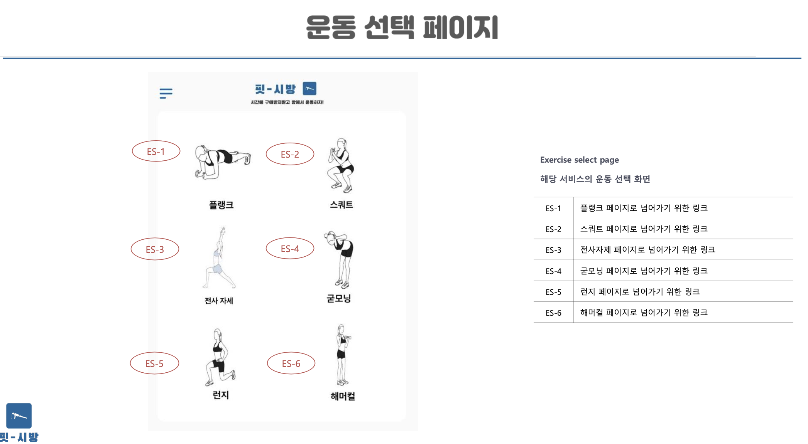
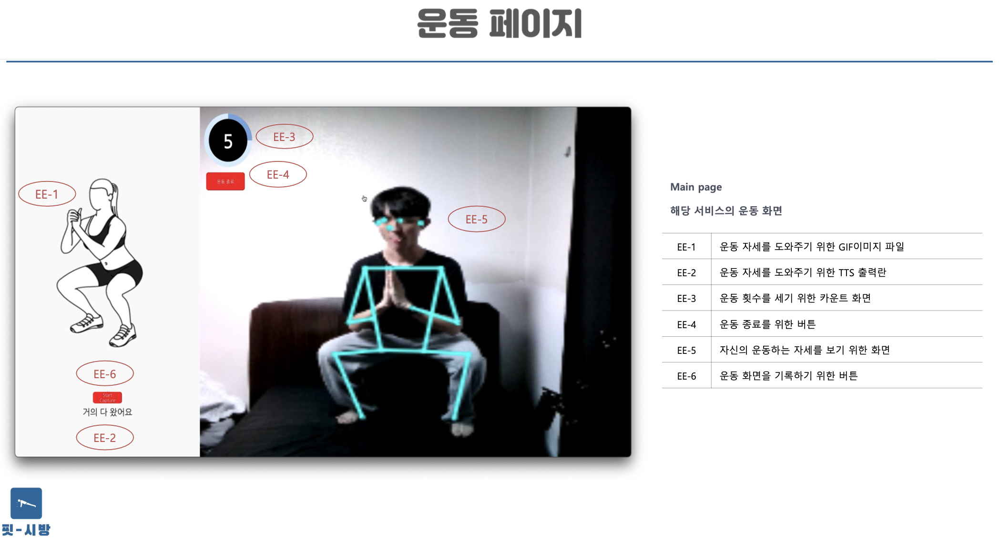
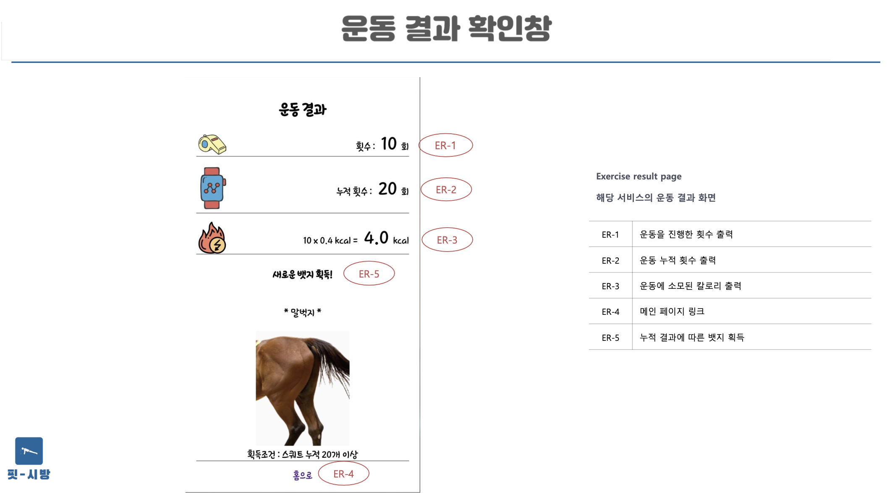
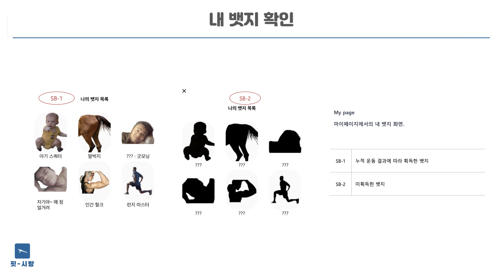

# Fit-sibang(시간에 구애받지 말고 방에서 운동하자!)

## Table of contents
{: .no_toc .text-delta }

1. TOC
{:toc}

---

## Contributors

- 이상민 [iDeal](https://github.com/d9249)
- 이선우 [happyssun96](https://github.com/happyssun96)
- 임한민 [hanminss](https://github.com/hanminss)
- 정범식 [JeongBeomSik](https://github.com/JeongBeomSik)
- 한상준 [sangzun](https://github.com/sangzun-han)

## Schedule management

[Capstone Design](https://www.notion.so/Capstone-Design-5cf2c2e66ce64994b1e4b06464d2c610)

## Code Execution method(local)

```
git clone https://github.com/KGU-Code-15/fit-sibang.git
npm install
cd client
npm install
cd -
npm run dev
```

## 목적
- 시간과 장소에 구애받지 말고 집에서 운동하자!
- AI를 이용한자세 추정을 통해 모든 기기로 해당 웹 서비스에 접속하여 운동

## 기능
- 자세 추정을 통한 운동 자세 교정
- 업적, 월간/주간 분석, 운동 기록 확인, 운동 영상 공유
- 지역 트레이너와의 채팅을 통한 온/오프라인 Meet-Up

## 개발환경
- FrontEnd : HTML, CSS, React
- BackEnd : Node.js MongoDB



## 기능








