# Chest Radiograph Disentanglement for COVID-19 Outcome Prediction

Kyonggi Univ. 2021. 02. BE530_0058.

COVID-19 결과 예측을 위한 흉부 방사선 사진 분리

Presentation Date: 2021.11.24

## Table of contents
{: .no_toc .text-delta }

1. TOC
{:toc}

---

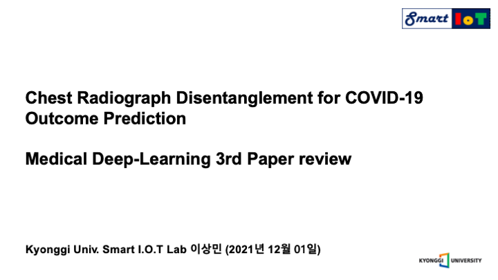

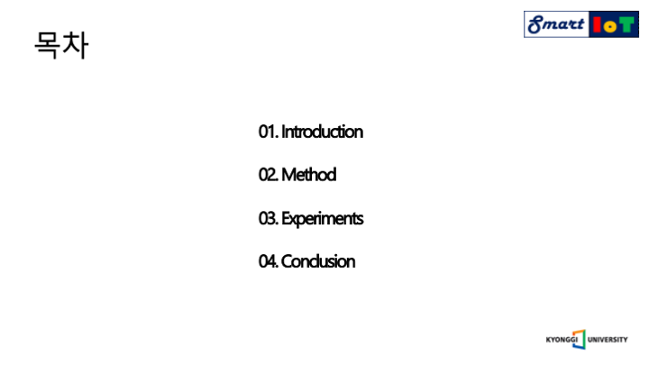

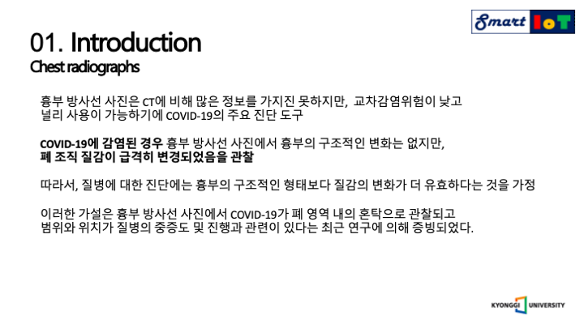

먼저 흉부 방사선 사진은 씨티에 비해 많은 정보를 가지진 못하지만 교차감염위험이 낮고 널리 사용이 가능하기에 코로나 진단에 있어서 주요한 도구입니다.

그리고 해당 논문에서는 코로나에 감염된 경우 흉부 방사선 사진에서 폐 조직의 질감이 급격하게 변하기 때문에

폐 영역 내의 혼탁을 통해 코로나를 진단하고 범위와 위치를 통해서 질병의 중증도를 알아낼 수 있다고 주장하였습니다.

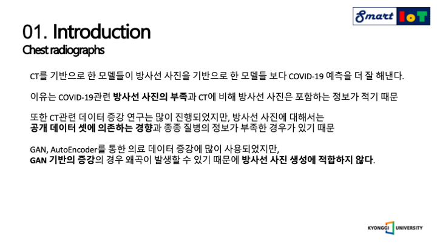

하지만 현재까지 CT를 기반으로 한 모델들이 흉부방사선을 기반으로 한 모델을 앞서는 이유를 다음과 같이 설명합니다.

코로나 관련 방사선 데이터의 부족과 CT에 비해 담긴 정보가 적기 때문이며, CT기반의 데이터 증강 연구는 많이 진행되었으나, 흉부 방사선 사진은 증강이 아닌 공개 데이터 셋에 의존하는 경향이 있으며, 이 마저도 라벨이 부족한 경우가 있기 때문이라고 설명하며, 데이터 증강을 위해서는 GAN과 오토인코더가 의료 데이터 증강에 많이 사용되지만 GAN은 아무래도 실존하지 않은 이미지이고, 왜곡이 발생할 가능성이 크기 때문에 방사선 사진 증강에는 적합하지 않다고 합니다.

그래서 해당 논문에서는 실제로 존재하는 이미지의 특징을 이용하여 증강을 진행하기 위해 오토 인코더 기법을 사용하였습니다.

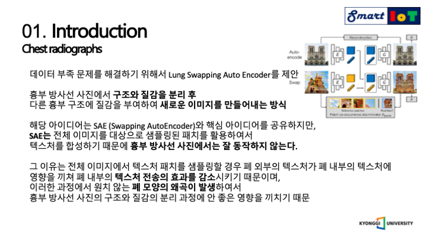

이러한 데이터 부족 문제를 해결하기 위해서 LSAE를 제안하였으며, 간단하게 말하자면, 흉부 방사선 사진에서 구조와 질감을 분리 한 후 다른 흉부 구조에 질감을 전송하여 새로운 이미지를 만들어내는 방식이라고 할 수 있습니다.

SAE와 LSAE는 핵심 아이디어를 공유하지만, 오른쪽 상단의 나와있는 SAE는 전체 이미지를 기반으로 패치를 샘플링하여 텍스처를 합성하기 때문에 흉부 방사선 사진에는 적합하지 않다고 합니다.

이유는 전체 이미지에서 텍스처 패치를 샘플링하여서 사용할 경우 폐 외부의 질감이 폐 내부의 영향을 끼쳐 폐 내부의 질감 전송의 효과를 감소시키며, 원치 않는 폐 구조의 왜곡을 발생시켜 분리와 합성 두가지 영역에서 안좋은 영향을 끼치기 때문입니다.

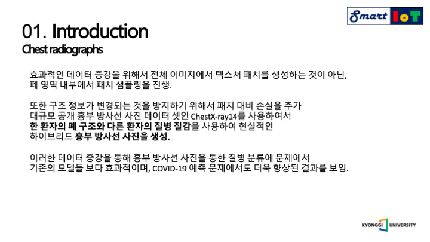

이러한 문제를 극복하기 위해서 전체 이미지에서 패치를 샘플링 하는것이 아니라 폐 영역 내부에서 패치 샘플링을 진행하였으며, 또한 구조적 형태가 왜곡되는 것을 방지 하기 위해서 구조적 패치 손실을 추가하였으며, 체스트엑스레이14 데이터 셋을 활용하여서 한 환자의 폐 구조와 다른 환자의 텍스처를 합성하여 현실적인 하이브리드 흉부 방사선 사진을 생성하였으며, 이러한 과정을 통해 흉부 방사선 이미지를 통해서 14가지의 질병을 분류하는 문제에서도 효과적이였으며, 기존의 다른 모델들 보다 코로나를 더 잘 예측 해낼 수 있었다고 합니다.

뒤로가면서 더 구체적인 설명을 진행하겠습니다.

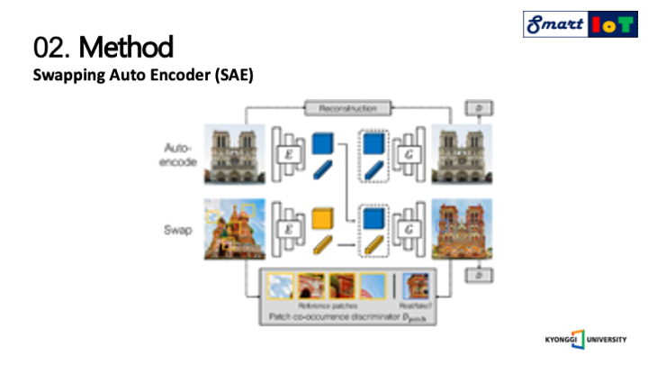

SAE에 대한 구체적인 차이점에 대해서 설명드리겠습니다.

SAE는 다음과 같은 구조를 가지고 있으며, 전체 이미지에서 패치된 이미지들의 질감을 모방하여서 생성된 이미지를 판별자에게 전달합니다.

하지만 SAE는 구조의 왜곡을 방지할 만한 supervision이 없기 때문에 구조의 왜곡이 발생할 수 있고, 또한 전송된 질병의 수준이 기존의 수준보다 감소되어서 전송되기 때문에 폐 외부의 질감이 폐 내부의 질감에 영향을 끼친다는 것을 알 수 있습니다.

결론적으로 SAE는 구조가 왜곡되며 질감 전송이 올바르게 되지 않는 이미지를 생성하기 때문에 흉부 방사선 이미지에 사용할 수 없다고 저자는 주장하였습니다.

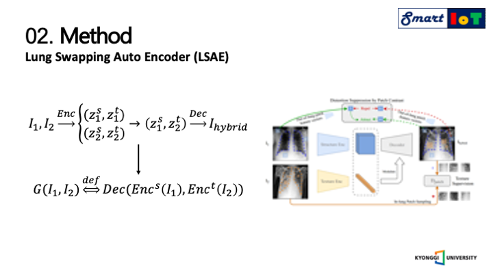

앞서 설명 드린 두 가지의 문제점들을 극복하기 위해서 

LSAE는 폐 내 질감의 올바른 전송을 위한 supervision과 폐 외 구조의 왜곡 억제를 설계하였으며 이 다음 페이지에서 자세한 설명을 드리도록 하겠습니다.

우선 전체적인 과정에 대한 설명을 먼저 하겠습니다. 

I1, I2는 사용된 두개의 이미지를 의미하며, 이미지를 인코더에 넣게 되면 구조를 나타내는 Zs, 질감을 나타내는 Zt로 각각 인코딩되며, 인코딩된 결과를 통해서 한 이미지에서는 구조 인코딩 결과를 한 이미지에서는 질감을 인코딩한 결과를 사용하여서 디코더에 넣어 하이브리드 이미지를 생성하게 됩니다.

이러한 과정을 함수로 나타내기 위해 위에서 보이는 함수 G로 도식화 하였으며 이는 하이브리드 이미지 생성을 위한 함수를 의미합니다.

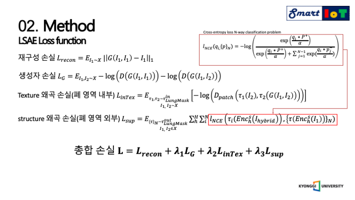

다음으로는 하이브리드의 올바른 이미지 생성을 위한 사용된 손실 함수들에 대해서 설명 드리겠습니다.

먼저 재구성 손실은 제일 위에 나와있는 Lrecon을 의미하며 그 다음 나와있는 LG는 GAN손실을 나타냅니다.

여기서 X는 이미지 훈련 세트이고, D는 판별자를 의미합니다.

해당 논문에서는 간결하게 표현하기 위해 제네레이터 부분만 나타내었습니다.

그 다음으로 설명드릴것은 세번째에 나와있는 텍스처 왜곡 손실 함수 입니다.

여기서 T는 LungMask의 다중 스케일 랜덤 분포를 의미하며, T1, T2는 T에서 샘플링된 두개의 operation이며, 생성기 G를 훈련하기 위해서 폐 내 영역의 패치만 샘플링 한다는 것을 의미합니다.

구조 왜곡 손실은 구조적 왜곡을 억제하기 위해 LSAE에 패치 대조 손실을 도입하였으며, 여기서 t out lungmask는 폐 영역 외부의 위치 샘플링 분포이고 H는 손실을 적용하는 레이어 수입니다.

오른쪽 제일 상단을 보시면 LNCE를 보시면 n개로 구분되는 문제를 대상으로 한 교차 엔트로피 함수를 나타내고 있으며, 동작 과정은 먼저 생성된 이미지를 구조 인코더를 통해 인코딩을 거친 후 h번째 레이어에서 특징 벡터 qi를 무작위로 샘플링하고 원본 대상 이미지에서는 인코더를 통해서 특징 벡터의 백을 생성합니다. 

여기서 p+는 qi에 해당하는 위치에서 가져오며 p-들은 다른 위치에서 가져옵니다.

이러한 손실 함수의 목표는 qi를 p+와 맞추고, 나머지의 p-의 값들에게서는 멀어지기 위함 입니다.

마지막 구조 왜곡 손실은 이러한 과정을 도식화한 결과입니다.

이러한 여러 손실 함수들에 하이퍼 매개변수를 곱하여 모두 더한 값을 최종 손실 값으로 사용하였습니다.

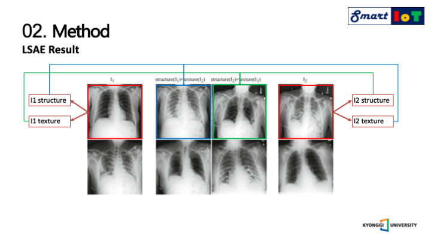

앞서 설명드린 과정에 대한 결과 이미지이며, 두개의 이미지를 각각 구조와 질감으로 분리하여 

또 다른 두 가지의 하이브리드 이미지를 생성한 결과를 나타냅니다.

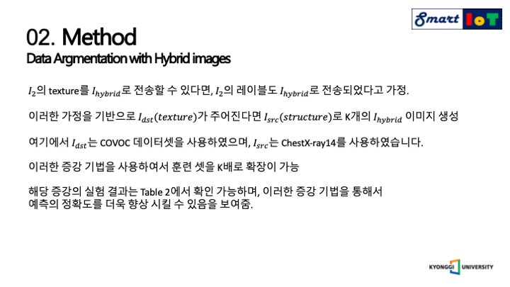

데이터 증강에 대한 설명을 드리겠습니다.

코로나 결과 학습데이터 보강을 위해서 하이브리드 이미지를 생성합니다.

𝐼_2의 texture를 𝐼_ℎ𝑦𝑏𝑟𝑖𝑑 로 전송할 수 있다면, 𝐼_2의 레이블도 𝐼_ℎ𝑦𝑏𝑟𝑖𝑑로 전송되었다고 가정하고 이러한 가정을 기반으로 𝑡𝑒𝑥𝑡𝑢𝑟𝑒가 주어진다면 𝑠𝑡𝑟𝑢𝑐𝑡𝑢𝑟e를 사용하여 K개의 𝐼_ℎ𝑦𝑏𝑟𝑖𝑑  이미지 생성할 수 있으며, 여기에서 𝐼_𝑑𝑠𝑡는 코로나 결과 데이터셋을 사용하였으며, 𝐼_𝑠𝑟𝑐는 ChestX-ray14를 사용하였습니다.

이러한 증강 기법을 사용하여서 훈련 셋을 K배로 확장이 가능하며 해당 증강의 실험 결과는 Table 2에서 확인 가능하며, 이러한 증강 기법을 통해서 예측의 정확도를 더욱 향상 시킬 수 있음을 보여주었다고 주장하였습니다.

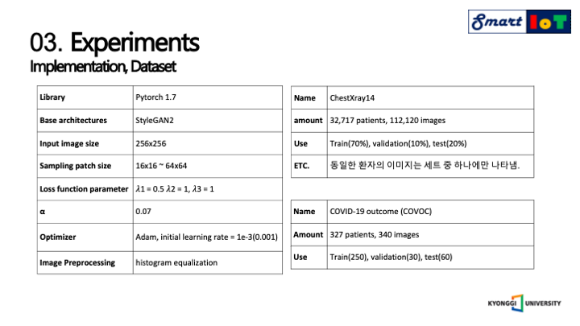

구현의 세부적인 사항에 대해서 설명드리겠습니다.

먼저 기본적으로 스타일갠2 모델의 아키텍쳐를 기본적으로 사용하였으며, 이미지 사이즈는 256 사이즈로 고정하여서 학습을 진행하였고, 샘플링 패치 사이즈는 16바이16 부터 64바이64 사이즈의 여러 이미지사이즈를 사용하였고 손실 함수에 람다 값을  파라미터로 사용하여서 각각 손실 함수의 영향도를 조절하였습니다.

최적 함수로는 아담을 사용하였고 러닝 레이트는 0.001을 주었으며 데이터 전처리로 히스토그램 평준화를 진행하여 학습에 사용하였습니다.

사용한 데이터 셋은 2가지를 사용하였는데 하나는 14가지의 폐 질환 정보를 가지고 있는 체스트엑스레이14 데이터셋을 사용하였으며, 약 3만명의 환자의 11만개의 이미지로 구성되어 있습니다.

이를 학습에 70% 검증에 10% 테스트에 20%로 나누어서 사용되었습니다.

코로나 결과 데이터셋은 327명 환자의 340장으로 구성되어 있으며 해당 데이터셋을 학습250장 검증30장 테스트 60장으로 나누어서 사용하였습니다.

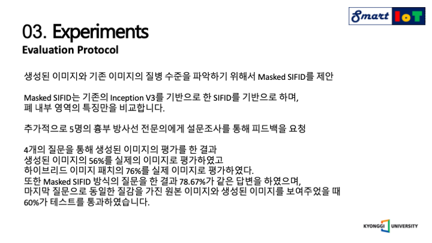

다음은 평가 방식에 대해서 설명드리겠습니다.

생성된 이미지와 기존 이미지의 질병 수준을 파악하기 위해서 Masked SIFID를 제안하였으며, Masked SIFID는 기존의 Inception V3를 기반으로 한 SIFID를 기반으로 하며, 폐 내부 영역의 특징만을 비교합니다.

추가적으로 5명의 흉부 방사선 전문의에게 설문조사를 통해 피드백을 요청하였으며, 4개의 질문을 통해 생성된 이미지의 평가를 한 결과 생성된 이미지의 56%를 실제의 이미지로 평가하였고, 하이브리드 이미지 패치의 76%를 실제 이미지로 평가하였습니다.

또한 Masked SIFID 방식의 질문을 한 결과 78.67%가 같은 답변을 하였으며, 마지막 질문으로 동일한 질감을 가진 원본 이미지와 생성된 이미지를 보여주었을 때 60%가 테스트를 통과하였다고 주장합니다.

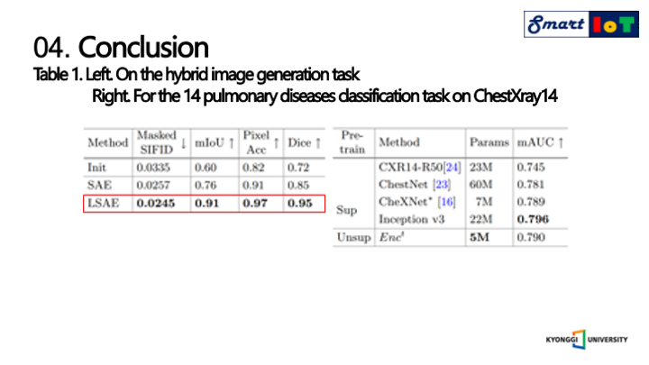

다음으로는 실험 결과에 대해서 설명드리겠습니다.

왼쪽의 표를 보면 앞서 설명한 Masked SIFID점수가 가장 낮을 것을 볼 수 있으며, 해당 점수가 낮을 수록 더욱 유사한 이미지라고 판단되었다는 의미를 가지며 다른 지표 또한 가장 높은 점수를 가지는 것을 알 수 있습니다.

이와 같은 결과를 보았을 때 폐 내부 질감의 전송이 잘 이루어짐을 알 수 있으며, LSAE가 기존의 SAE를 크게 능가하고 모든 분할 메트릭에서 90% 이상을 달성하여 제안한 방식이 구조적 왜곡을 효과적으로 억제할 수 있음을 증명하였다고 합니다.

또한 폐 질환이 흉부 방사선 사진의 조직과 밀접하게 관련이 있다는 가설을 증명하기 위해서 인코더t를 폐 질환 분류와 코로나 예측 작업 모두에서 평가하였으며 오른쪽 표는 14가지의 폐 질환 분류 작업에서 다른 모델들과 비교하였을 때 더 적은 양의 모델의 크기로 경쟁력 있는 결과를 달성하였다는 것을 알 수 있습니다.

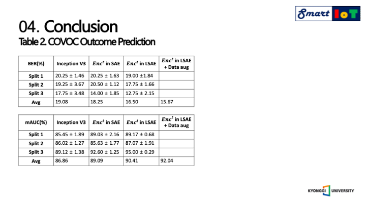

다음으로 코로나 결과에 대한 예측 표 입니다.

BER과 평균AUC를 사용하여서 모델을 평가하였으며, 텍스쳐 인코더는 인셉션 모델을 능가함을 알 수 있으며, SAE에서 사용하였던 인코더 보다 성능이 더 뛰어남을 알 수 있었으며, 코로나 결과 훈련 데이터셋을 기존의 제안하였던 증강 기법으로 증강 후 같은 실험을 진행한 결과 더욱 우수한 결과를 내었고 해당 증강에는 ChestX-ray14 이미지가 사용되었는데 다른 관련 없는 질병의 간섭을 피하기 위해 건강한 폐의 구조 이미지만 사용하였습니다.

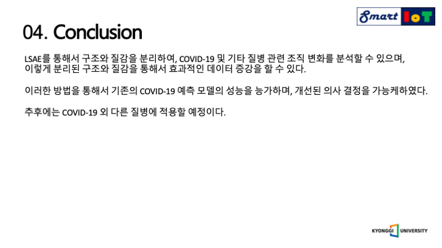

최종적인 결과에 대해서 설명드리겠습니다.

해당 저자는 LSAE를 통해서 구조와 질감을 분리하여, 코로나 및 기타 질병 관련 조직 변화를 분석할 수 있으며, 이렇게 분리된 구조와 질감을 통해서 효과적인 흉부 방사선 데이터 증강을 할 수 있으며, 이러한 방법을 통해서 기존의 코로나 예측 모델의 성능을 능가하며, 개선된 의사 결정을 가능케하였다.

추후에는 코로나 외 다른 질병에 적용할 예정이라고 합니다.